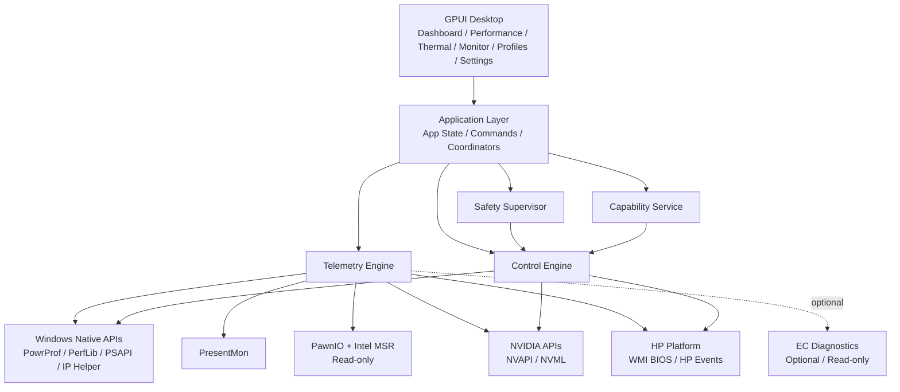
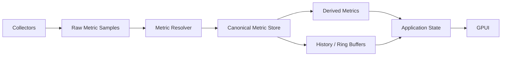
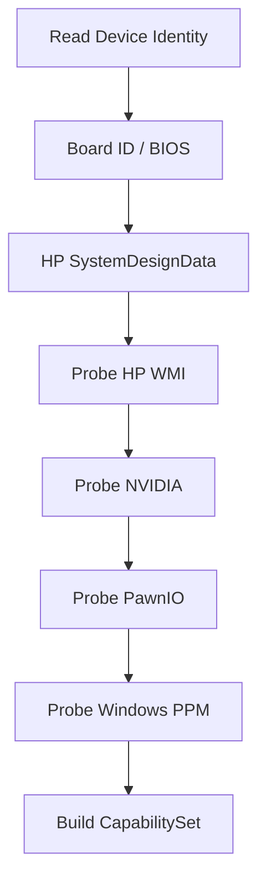

# Phelper — Architecture Baseline

> Status: Architecture Baseline v0.1  
> Date: 2026-08-24  
> Reference platform: HP OMEN 9 / Intel Core i9-13900HX / NVIDIA GeForce RTX 4060 Laptop / Windows 11  
> Working product name: TBD  
> Primary implementation language: Rust  
> UI framework: GPUI + gpui-component  

---

## 1. 文档目的

本文档定义一个面向 HP OMEN 笔记本的轻量级性能管理与硬件遥测软件的第一版系统架构基线。

它不是对现有 Omen Gaming Hub（OGH）的简单重制，也不是对 OmenSuperHub 的 UI 换皮。项目的目标是建立一个长期可维护、可验证、低开销、控制行为透明的性能控制平台：

- 统一观察 CPU、GPU、散热、系统负载和游戏帧性能；
- 统一管理 CPU power policy、HP 平台性能模式、GPU power policy、风扇和 MUX；
- 明确区分“软件希望硬件处于什么状态”与“硬件实际上处于什么状态”；
- 优先使用 Windows、HP Firmware、NVIDIA 等正式接口；
- 尽可能避免直接操作 Embedded Controller（EC）；
- 将安全性、能力探测、错误恢复作为架构一级概念，而不是补丁；
- 第一阶段优先把 reference platform 做到稳定可靠，而非追求所有 OMEN/Victus 机型的泛化覆盖。

本文档既是 System Design Document，也是后续开发中的 Architecture Decision Baseline。后续新增功能应首先判断它属于哪一层、由谁拥有状态、通过哪条 read/write path，并检查是否违反本文档中的架构不变量。

---

# 2. 项目定位

## 2.1 软件要解决的问题

OGH 的主要问题并不是功能缺失，而是：

- 功能边界混杂；
- 性能控制缺少透明度；
- 很难观察每个模式究竟改变了哪些参数；
- 大量非核心内容与后台组件增加了复杂度；
- 对高级用户而言，性能、功耗、温度和风扇之间的关系不够可解释。

本项目希望将产品重新定义为：

> 一个以性能、功耗、散热和可观测性为中心的 OMEN 笔记本控制面。

它首先服务于长期稳定使用，而不是追求“能 hack 出多少 OEM 功能”。

---

## 2.2 第一 reference platform

第一阶段明确只要求对以下机器做到高质量支持：

```text
OMEN Gaming Laptop 16-wf0032TX（SKU 81L09PA）
Board ID 8BAB（Win32_BaseBoard.Product，实机已确认）
Intel Core i9-13900HX
NVIDIA GeForce RTX 4060 Laptop GPU
Windows 11
```

**支持范围就是这一台机器**（具体 SKU，不是"16-wf0xxx 系列"）。board ID 是能力的唯一键：HP 复用产品名，绝不用产品名做匹配（实机验证详见 `docs/feasibility-16-wf0032TX.md`）。

这台机器应当成为：

- 协议验证平台；
- 默认参数标定平台；
- 风扇、功耗和性能 profile 的第一 reference implementation；
- 遥测准确性验证平台；
- UI 和控制行为的端到端测试平台。

第一阶段不应因为“未来可能支持其他机型”而引入大量未经验证的抽象。

---

# 3. Goals / Non-Goals

## 3.1 Goals

项目第一阶段应完成：

1. 高质量实时硬件遥测；
2. CPU 精细化 power policy；
3. HP WMI 性能控制；
4. NVIDIA GPU 遥测；
5. 风扇与 thermal mode 管理；
6. Profile 管理；
7. 游戏性能帧遥测；
8. 可解释的控制状态；
9. 可追踪日志和诊断能力；
10. 低空闲资源占用；
11. 明确的硬件安全边界。

---

## 3.2 Non-Goals

第一阶段明确不追求：

- 支持所有 HP / OMEN / Victus 产品；
- 自己实现一个 HWiNFO / LibreHardwareMonitor；
- 直接 reverse engineer 所有 EC register；
- arbitrary EC write；
- 通用 CPU overclocking；
- BIOS 修改；
- 未验证的 voltage tuning；
- 复杂 RGB 编辑器（对本机是无效议题：16-wf0032TX / 81L09PA 实为 **1 区白色背光键盘**，无 RGB 硬件——HP 规格页与实机一致；背光开关由 EC/FN 键硬件处理，不依赖任何软件；0x20009 灯光命令组对本机无意义，连诊断都不做）；
- 云服务、账号体系、内容推荐；
- 游戏商城、壁纸、资讯等非性能功能；
- 多进程/微服务式过度拆分。

---

# 4. Architecture Principles

以下规则属于项目的硬性架构不变量。

## AR-01 — UI never talks directly to hardware

GPUI 层禁止直接：

- 调 WMI；
- 调 PowrProf；
- 调 NVAPI / NVML；
- 调 PawnIO；
- 访问 MSR；
- 访问 HP firmware；
- 访问 EC。

UI 只能发送 Application Command，并订阅 Application State。

---

## AR-02 — Read path 和 Write path 严格分离

遥测负责：

> 机器正在发生什么？

控制负责：

> 软件希望机器变成什么？

两者的数据结构、生命周期、错误模型和线程模型必须分离。

---

## AR-03 — 所有写操作必须经过 ControlCoordinator

无论写操作来自：

- Performance 页面；
- Thermal 页面；
- Tray；
- Hotkey；
- Profile；
- 自动调优；
- CLI；
- 将来的 API；

最终必须进入同一个 ControlCoordinator。

不存在第二条“快捷硬件写路径”。

---

## AR-04 — Hardware mutation 使用 single-writer 模型

硬件控制操作必须串行化。

不允许多个 subsystem 同时：

- 改 PL；
- 改 fan；
- 改 GPU mode；
- 改 thermal policy；
- 改 Windows CPU policy。

---

## AR-05 — Capabilities are discovered, never assumed

不能因为：

```text
OMEN + Intel + NVIDIA
```

就默认所有功能可用。

必须根据：

- Product；
- Board ID；
- BIOS version；
- ThermalPolicyVersion；
- SystemDesignData；
- 实际 WMI capability；
- GPU capability；
- PawnIO availability；

生成 CapabilitySet。

---

## AR-06 — Unknown means unsupported, not guessed

对于未知硬件行为：

```text
unknown != probably supported
```

如果无法确认：

- register；
- command；
- range；
- semantics；

则功能应标记为 unsupported 或 experimental，而不是猜测。

---

## AR-07 — Direct EC writes are prohibited in supported control paths

正式控制架构不直接写 EC。

EC 在第一版中最多是：

- optional；
- read-only；
- diagnostics；
- board-verified。

如果一个功能只有 EC write 才能完成，应单独进行架构审查，而不是自动将 EC 作为 fallback。

---

## AR-08 — Windows policy 由 Windows API 管理

例如：

- EPP；
- processor max frequency；
- power scheme；
- processor PPM settings；

应使用 Windows PowrProf / Processor Power Management 接口。

不要同时通过 PawnIO/MSR 直接修改 HWP policy。

---

## AR-09 — PawnIO 在第一阶段只作为受约束的 read infrastructure

PawnIO 的角色是读取：

- Intel architectural / documented MSR；
- thermal status；
- RAPL energy；
- APERF / MPERF；
- 必要的低层 telemetry。

Application 层不暴露 generic：

```rust
write_msr()
write_io_port()
write_ec()
```

接口。

---

## AR-10 — Desired / Observed / Telemetry 必须分离

任何写操作都至少要区分：

```text
requested
applied
verified
```

不能把：

```text
API returned success
```

等同于：

```text
hardware is verified in desired state
```

---

## AR-11 — Control must fail closed

无法确定是否安全、是否支持、是否已验证时：

> 不写。

硬件控制软件不能采用“先试试看”的 fail-open 风格。

---

## AR-12 — Firmware safe state 优先

尤其 fan control：

应用异常退出、控制超时或失联时，应尽可能恢复：

```text
firmware automatic control
```

而不是让软件成为维持散热安全的唯一依赖。

---

# 5. Top-Level Architecture



顶层逻辑可以归纳为四块：

```text
Presentation
    ↓
Application
    ↓
Telemetry + Control
    ↓
Platform Adapters
```

---

# 6. Recommended Rust Workspace

第一版不建议拆成十几个微 crate，但应明确依赖方向。

```text
project/
├── apps/
│   └── desktop/
│       ├── src/
│       └── Cargo.toml
│
├── crates/
│   ├── core/
│   ├── application/
│   ├── telemetry/
│   ├── hp/
│   ├── nvidia/
│   ├── windows/
│   └── persistence/
│
└── Cargo.toml
```

---

## 6.1 `core`

负责纯 domain model。

允许：

- Rust std；
- serde 等纯数据依赖。

禁止：

- GPUI；
- Win32；
- WMI；
- NVAPI；
- PawnIO；
- platform-specific implementation。

主要内容：

```text
DeviceIdentity
Capabilities
Telemetry types
PerformanceProfile
CpuPolicy
FanPolicy
GpuPolicy
DesiredState
ObservedState
ControlCommand
ControlError
Ports / Traits
```

---

## 6.2 `application`

负责 use cases 和 orchestration。

主要组件：

```text
AppState
DeviceManager
CapabilityService
ProfileManager
ControlCoordinator
SafetySupervisor
TelemetryCoordinator
```

它决定：

> 一次用户操作应该如何被执行。

但不负责具体 Win32 / WMI implementation。

---

## 6.3 `telemetry`

负责统一遥测系统：

```text
Metric registry
Collectors
Metric resolver
Canonical metric store
History ring buffers
Derived metrics
Staleness
Sampling scheduler
```

---

## 6.4 `hp`

负责 HP / OMEN platform adapter：

```text
HP WMI transport
OMEN command definitions
SystemDesignData parsing
thermal policy
fan WMI
power limits WMI
GPU power mode WMI
MUX WMI
OMEN key WMI event
board capability database
```

正式代码中不提供 generic EC writer。

---

## 6.5 `nvidia`

负责：

```text
NVAPI FFI
NVML FFI
GPU discovery
metric normalization
capability probing
```

---

## 6.6 `windows`

负责：

```text
PowrProf
Processor PPM
PerfLib / PDH
PSAPI
IP Helper
Power notifications
PresentMon adapter
Tray
Autostart
Windows lifecycle
```

---

## 6.7 `persistence`

负责：

```text
application settings
performance profiles
board overrides
logs metadata
migration
```

---

# 7. Dependency Direction

期望的依赖方向：

```text
desktop
   ↓
application
   ↓
core

telemetry ─────→ core
hp ────────────→ core
nvidia ────────→ core
windows ───────→ core
persistence ───→ core
```

核心规则：

```text
core MUST NOT depend on UI or platform crates.
```

Backend 实现 core 定义的 ports，而不是 core 反向依赖 backend。

---

# 8. Domain Model

## 8.1 DeviceIdentity

```rust
pub struct DeviceIdentity {
    pub manufacturer: String,
    pub product_name: String,
    pub board_id: String,
    pub bios_version: String,

    pub cpu: CpuIdentity,
    pub gpu: Vec<GpuIdentity>,
}
```

这个对象描述：

> 机器是什么。

---

## 8.2 CapabilitySet

```rust
pub struct CapabilitySet {
    pub cpu_policy: CpuPolicyCapabilities,
    pub cpu_power: CpuPowerCapabilities,
    pub gpu: GpuCapabilities,
    pub fan: FanCapabilities,
    pub thermal: ThermalCapabilities,
    pub mux: MuxCapabilities,
    pub lighting: LightingCapabilities,
}
```

例如：

```rust
pub struct FanCapabilities {
    pub fan_count: usize,
    pub max_fan: bool,
    pub manual_level: bool,
    pub rpm_readback: bool,
    pub firmware_timeout: Option<Duration>,
}
```

---

# 9. 三类核心状态

整个应用围绕三个不同的状态对象运行。

## 9.1 DesiredState

用户希望机器处于什么状态。

例如：

```text
Profile = Gaming
CPU EPP = 35
CPU PL1 = 45 W
CPU PL2 = 70 W
GPU cTGP = Enabled
PPAB = Enabled
Thermal Mode = Performance
```

---

## 9.2 ObservedState

通过 readback / firmware query 确认到的配置状态。

例如：

```text
CPU EPP = 35
Thermal Mode = Performance
GPU cTGP = Unknown
Fan Mode = Firmware Auto
```

---

## 9.3 TelemetryState

实时运行数据。

例如：

```text
CPU Package Power = 34.2 W
CPU Package Temp = 71 °C
GPU Power = 94 W
GPU Temp = 68 °C
Fan 1 = 3500 RPM
FPS = 157
```

---

# 10. Telemetry Architecture

## 10.1 基本原则

不存在一个“万能免费 SDK”作为全部 telemetry 的唯一来源。

项目采用：

> 按数据域选择最权威的 source，然后统一归一化。

---

## 10.2 Telemetry Pipeline



---

# 11. Canonical Metric Model

Collector 不允许直接向 UI 写：

```text
cpu_temp
gpu_temp
```

必须生成统一 sample。

```rust
pub struct MetricSample {
    pub id: MetricId,
    pub value: MetricValue,
    pub source: MetricSource,
    pub timestamp: Instant,
    pub quality: MetricQuality,
}
```

建议：

```rust
pub enum MetricQuality {
    Fresh,
    Estimated,
    Stale,
    Unavailable,
    Unsupported,
}
```

---

# 12. Metric Ownership

这一部分是整个 telemetry 体系最重要的规范之一。

| Metric | Primary Source | Fallback |
|---|---|---|
| FPS | PresentMon | None |
| Frame time | PresentMon | None |
| Present latency | PresentMon | None |
| GPU busy/frame metrics | PresentMon | None |
| CPU utilization | Windows | PresentMon |
| Per-core utilization | Windows | None |
| CPU package temperature | PawnIO / Intel MSR | PresentMon if verified |
| CPU effective frequency | APERF/MPERF | Windows |
| CPU package energy | PawnIO / RAPL | None |
| CPU package power | RAPL delta | PresentMon if verified |
| CPU thermal status | PawnIO / Intel MSR | None |
| GPU temperature | NVAPI / NVML | PresentMon |
| GPU power | **NVML `nvmlDeviceGetPowerUsage`**（2026-08-25 实机推翻 R5：AD107 Laptop + 驱动 581.x 上 NVML 功率连续可信——睡眠 1.8W / memset 负载 61.7W / 回落 8.4W；同负载与 nvidia-smi 对表一致） | NVAPI ClientPowerTopology（本机实测 num_entries=0，空闲与满载皆然——仅作声明式 fallback） |
| GPU utilization | NVML/NVAPI | PresentMon |
| GPU clocks | NVAPI | NVML |
| GPU P-State | NVAPI | None |
| GPU throttle reason | NVAPI GetPerfDecreaseInfo | None |
| VRAM usage | NVAPI GetMemoryInfoEx（GPU handle；GetMemoryInfo 需要 display handle，hybrid 模式 dGPU 没有） | PresentMon |
| RAM | Windows | None |
| Disk | Windows | None |
| Network | Windows | None |
| Fan state/RPM | HP WMI if supported | optional read-only EC |
| HP thermal mode | HP WMI / verified firmware state | None |
| PCH / OEM sensors | HP WMI if available | optional diagnostics |

核心规则：

> 不因为两个 source 都能读一个数，就让两个 collector 同时成为 authoritative source。

---

# 13. PresentMon 的定位

PresentMon 不作为万能硬件传感器库。

它的主要职责是：

```text
FPS
frame time
present mode
CPU/GPU frame timing
display latency
process ↔ graphics workload
游戏性能统计
```

PresentMon 2.x 的 service/API 同时能够暴露多种硬件 telemetry，因此可以作为部分指标 fallback，但项目不依赖它来保证 CPU package temperature / power 的唯一可用性。

为什么保留 PresentMon：

- Windows 上游戏帧测量成熟；
- ETW-based；
- 支持不同 graphics API；
- SDK/API 可供程序使用；
- MIT License；
- 后续可以直接支持游戏 overlay、benchmark 和 profile 对比。

---

# 14. Windows Native Telemetry

Windows 自己应该拥有 OS 层数据。

## CPU

```text
CPU utilization
per-core utilization
user/kernel time
processor utility
performance limit
```

## Memory

```text
physical used
physical available
commit
commit limit
working set
private bytes
```

## Disk

```text
read/write throughput
IOPS
latency
queue depth
utilization
```

## Network

```text
RX/TX
packet rate
interface utilization
```

这些数据不应通过 LibreHardwareMonitor 或 HWiNFO 获取。

---

# 15. CPU Telemetry via PawnIO / Intel MSR

对于 i9-13900HX，CPU silicon-level telemetry 采用：

```text
PawnIO
  ↓
allow-listed Intel MSR
  ↓
canonical metrics
```

第一阶段严格 read-only。

重点读取：

```text
IA32_PACKAGE_THERM_STATUS
IA32_THERM_STATUS
IA32_TEMPERATURE_TARGET

IA32_APERF
IA32_MPERF

MSR_RAPL_POWER_UNIT
MSR_PKG_ENERGY_STATUS

必要时：
MSR_PKG_POWER_LIMIT（读取用于验证）
```

---

## 15.1 CPU Package Power

推荐通过 RAPL energy delta 计算：

```text
P = ΔE / Δt
```

这样得到的不是“配置的功耗上限”，而是实际 package power。

---

## 15.2 Effective Clock

不要只显示 requested / reported GHz。

利用 APERF / MPERF 推导 effective frequency，可以更准确地解释：

```text
Task Manager 显示高频
但实际 CPU 大量处于 idle
```

的情况。

---

# 16. CPU Power Policy Architecture

CPU 控制不能被抽象成单个：

```text
PL1 slider
```

应定义为完整的 `CpuPolicy`。

```rust
pub struct CpuPolicy {
    pub energy_preference_ac: Option<u8>,
    pub energy_preference_dc: Option<u8>,

    pub max_frequency_ac: Option<u32>,
    pub max_frequency_dc: Option<u32>,

    pub boost_policy: Option<BoostPolicy>,

    pub power_limits: CpuPowerLimits,
}
```

---

# 17. CPU Policy 的四个控制维度

```text
Responsiveness
    → EPP

Frequency Envelope
    → Max Frequency
    → Boost policy

Power Envelope
    → PL1
    → PL2
    → PL4 / concurrent limit

Scheduling / Idle
    → Windows PPM
    → core parking / heterogeneous policies（后续）
```

---

# 18. EPP 是一级控制参数

Windows `PERFEPP / PERFEPP1` 为正式 Processor Power Management setting。

范围：

```text
0   = favor performance
100 = favor energy saving
```

因此项目应当将 EPP 作为 CPU policy 的核心，而不是隐藏的专家参数。

推荐 UI：

```text
CPU Responsiveness

Performance                     Efficiency
0 ─────────────●──────────────── 100
               45
```

---

## 18.1 为什么 EPP 比 PL1 更适合轻负载优化

PL1 约束的是持续功率 envelope。

但：

```text
1~2 个 P-core 在轻负载瞬时高频
```

通常仍然远低于 PL1。

因此用户看到：

```text
CPU utilization 很低
频率却很高
```

时，应优先分析：

```text
EPP
effective clock
package power
C-state / idle behavior
background wakeups
```

而不是单纯降低 PL1。

---

## 18.2 AC/DC 分离

Profile 应支持：

```text
EPP AC
EPP DC
```

未来也可以扩展：

```text
Max Frequency AC/DC
Boost AC/DC
```

---

# 19. Windows CPU Policy Backend

Windows PPM policy 使用：

```text
PowrProf.dll
PowerReadACValueIndex
PowerReadDCValueIndex
PowerWriteACValueIndex
PowerWriteDCValueIndex
PowerSetActiveScheme
```

项目禁止将 `powercfg.exe` shell command 作为正式核心 backend。

`powercfg` 可用于：

- 开发验证；
- diagnostics；
- test fixture。

正式软件走原生 Win32 API。

---

# 20. HP Platform Control Architecture

HP 平台控制采用 WMI BIOS 作为正式 backend。

```text
Application
    ↓
HpWmiController
    ↓
HP BIOS WMI
    ↓
Firmware
    ↓
Hardware
```

其优先级显著高于 direct EC write。

---

# 21. HP WMI Transport

已知 HP laptop WMI firmware interface 包括：

```text
BIOS WMI GUID:
5FB7F034-2C63-45E9-BE91-3D44E2C707E4
```

Linux `hp-wmi` 使用的主要 gaming command group：

```text
HPWMI_GM = 0x20008
```

Windows 社区实现（例如 OmenHwCtl / OmenMon）使用 `root\wmi` 中 HP BIOS WMI provider 与相应 input structures。

实现时应封装为：

```rust
trait HpBiosTransport {
    fn execute(
        &self,
        command: HpCommand,
        command_type: HpCommandType,
        input: &[u8],
        output_size: usize,
    ) -> Result<Vec<u8>, HpWmiError>;
}
```

所有 payload parser 放在 transport 之上。

**8BAB F.30 实机 MOF 事实（`Get-CimClass` dump + 实机往返验证）**：

```text
namespace : root\wmi   （ACL 仅管理员 → 探测/控制进程必须提权）
class     : hpqBIntM，实例 "ACPI\PNP0C14\0_0"
methods   : hpqBIOSInt{0,4,128,1024,4096}(InData: Instance, OutData: Instance) -> Boolean
入参类    : hpqBDataIn { Command:u32, CommandType:u32, hpqBData:u8[],
                         Size:u32, Sign:u8[4]="SECU" }（另有 Active/InstanceName 实例属性）
出参类    : hpqBDataOut{N}（按方法大小区分；非注册类，运行时动态读属性）
            属性 = { Active, Data:u8[], InstanceName, rwReturnCode:u32, Sign="PASS" }
            —— 注意：数据属性叫 Data（入参侧才叫 hpqBData）；
            Sign="PASS" 可作每次调用的固件往返完整性校验
insize    : 本机 Zero 模式（Size=0）读正常（hp-wmi.c zero_if_sup 行为）
```

---

# 22. 已知重要 HP WMI Command Surface

以下命令已有 Linux `hp-wmi` 或多个社区实现交叉验证。

| CommandType | 功能 | Confidence |
|---:|---|---|
| `0x10` | Fan Count（**兼作 keep-alive 心跳 op**，见 §33.1） | High（8BAB 实测 ✓） |
| `0x11` | Fan Speed Get（部分机型） | High |
| `0x1A` | Performance / Thermal Mode Set | Very High |
| `0x21` | GPU Thermal/Power Mode Get | Very High（8BAB 实测 ✓） |
| `0x22` | GPU Thermal/Power Mode Set | Very High |
| `0x26` | Max Fan Get | **不可靠，诊断专用**：内核标记此命令在 Victus S 系固件误报（commit 46be1453e6），并已停止调用；max-fan 状态一律由应用自追踪（ObservedValue::TrustedWrite） |
| `0x27` | Max Fan Set | Very High |
| `0x28` | System Design Data | Very High（8BAB 实测 ✓） |
| `0x29` | CPU / Platform Power Limits | **字节序已定案**（byte0=PL2/byte1=PL1，见 §25），三步验证通过，仍 Experimental 门禁 |
| `0x2D` | Fan Level Get | High（8BAB 实测 ✓） |
| `0x2E` | Fan Level Set | High |
| `0x2F` | Fan Table Get | High（8BAB 实测 ✓） |
| `0x52` | MUX Get/Set（cmd group 0x01 读 / 0x02 写，重启生效） | High（8BAB 实测读 ✓） |

---

# 23. Thermal Policy

当前已知 OMEN thermal policy 至少存在 V0 / V1 两套映射。

V1 常见：

```text
Default / Balanced = 0x30
Performance        = 0x31
Cool               = 0x50
```

V0 常见：

```text
Default     = 0x00
Performance = 0x01
Cool        = 0x02
```

因此：

```rust
enum ThermalPolicyVersion {
    V0,
    V1,
}
```

必须由 capability discovery 决定映射。

禁止直接：

```rust
PerformanceMode::Performance as u8
```

写 firmware。

**8BAB 实机定论（F.30）**：SDD byte3 = 1 → 本机静态 V1，BoardProfile 直接锁定，无需运行时探测。可写枚举只有 `{Balanced=0x30, Performance=0x31}`——`Cool=0x50` 在本机未确认，按 AR-06 不进可写枚举。

**Thermal mode 的回读问题**：0x1A 无可靠 Get。本机的 ObservedState 策略是「信任写入 + keep-alive 重断言」（`ObservedValue::TrustedWrite`，由 KeepAliveService 维护）；EC `0x59` 只读诊断作为可选旁证（`experimental-ec` feature，仅板级验证后启用）。

---

# 24. System Design Data (`0x28`)

`0x28` 是 capability discovery 的核心数据之一。

社区已交叉使用的字节（8BAB F.30 实机已读回验证）：

| byte | 含义 | 来源 | 8BAB 实测 |
|---:|---|---|---|
| 3 | thermal policy version（1 = V1/krpm） | Linux `hp-wmi` | `0x01` ✓ |
| 4 bit0 | 软件风扇控制支持声明 | OmenSuperHub | `1` ✓ |
| 5 | 默认 PL4（W） | OmenMon | `0xC8` = 200W ✓ |
| 7 | MUX 能力位（bit3 = 支持 MUX） | Linux `hp-wmi` | `0x0C` ✓ |

其余字节维持「未验证不升级」原则：

- 可以解析存档；
- 但不能因为某个旧项目对 bit 的解释成立，就认为它是全产品线 ABI。

规则：

> undocumented bit semantics 必须经过 reference platform 或独立实现交叉验证后，才能升级为正式 capability。

---

# 25. CPU / Platform Power Limits (`0x29`)

当前 Linux `hp-wmi` 定义：

```c
struct victus_power_limits {
    u8 pl1;
    u8 pl2;
    u8 pl4;
    u8 cpu_gpu_concurrent_limit;
};
```

**字节序冲突已定案（2026-08-26，8BAB 实机双重 A/B 仲裁，spike S2）**：8BAB 固件要求 **byte0=PL2、byte1=PL1——与内核 struct 相反**。证据：内核序写 `{2D(45), 5A(90), FF, FF}` → MSR 0x610 读出 PL1=90/PL2=45；交换序写 `{82(130), 37(55), FF, FF}` → 0x610 读出 PL1=55/PL2=130。效果即时（写后第一个 250ms 轮询即变）。OSH 的 `SetCpuPowerLimit(v,v)` 两字节同值，对顺序零举证——冲突曾经真实存在但只有 bytes 0/1 需要仲裁。`0xFF` = 按字节 NO_CHANGE（内核常量 `HP_POWER_LIMIT_NO_CHANGE`），解决 pl4/cc 保留问题；pl4/cc 显式写仍未验证 → 传输层拒绝非零值。

**`{0,0,FF,FF}`（`HP_POWER_LIMIT_DEFAULT`）恢复写在本固件 500ms 内不生效**（仲裁实验中实测：写后 0x610 保持原值）。因此停机恢复 = 显式写回首次写入前捕获的 0x610 基线，绝不依赖 0x00。

**三步验证已于 M3 全部通过（HIL-4）**：0x29 写 → 0x610 回读 Verified → 32 线程 RAPL 负载 200s：持续段被钳在均值 44W 长达 160s（PL1=45 生效；默认 55W 基线 settle ~53-55W），turbo 段封顶 ~90-100W（PL2=90；默认峰值 108W）→ 停机恢复 55/130（journal rc=0 + 遥测回读）。

**固件 clawback 风险（R1）**：OmenMon issue #37 在真实 8BAB 上记录——OGH 退出后 CPU 被锁 55W、风扇锁自动。对策：KeepAliveService 在 dirty 期间每次心跳重断言 0x29（保险），停机恢复写回基线。**实测（HIL-5）**：Balanced 模式下 300s hold 期间经历完整拔电→电池→回插，0x610 全程平在写入值，无任何跌落——内核 victus 的 AC/DC 重实际化是 Performance 模式专属路径，本机 Balanced 下不发生；0x29 也不像风扇/thermal 那样有 ~120s clawback。

0x29 仍永久保持 `Support::Experimental` + cargo feature 双门禁：三步验证证明了 PL1/PL2 写-读-执行闭环，但 pl4/cc 未验证、长期固件行为（重启持久性等）未表征，稳定 UI 不出现。

验证手段（Phase 2 的**强制门禁**，不是可选项）：

```text
WMI 0x29 write
    ↓
MSR_PKG_POWER_LIMIT readback（0x610，PawnIO）
    ↓
RAPL package power under load（0x611 能量差分）
```

---

# 26. GPU Platform Policy (`0x21 / 0x22`)

当前 Linux `hp-wmi` 定义 payload：

```text
ctgp_enable
ppab_enable
dstate
gpu_slowdown_temp
```

这部分属于 HP 平台 power policy，而不是 NVIDIA driver-level telemetry。

因此结构上：

```text
HP WMI
→ 平台 GPU 功耗/thermal policy

NVAPI/NVML
→ GPU 实际运行状态
```

两者职责必须分开。

**M3 实机记录（0x22 写已实现）**：8BAB 的 0x21 读回 `slowdown_temp_c` 恒为 0（本板无此旋钮）——读改写时按原样保留（safety 层特判 0 = preserve，显式用户值仍需 30..=110°C）。写路径：0x22 → 0x21 延迟回读 Verified（3×1s 轮询全字段相等）；停机恢复写回启动时读回值（仅当本会话写过）。HIL-2 行为证据：cTGP off 期间 GPU 负载功率平台 59.4W vs on 基线 64.4W（NVML 采样，CUDA memset 负载上限本身低于 80W TGP）；复原后 0x21 确认 ctgp=true。

---

# 27. Fan Control

正式支持路径：

```text
HP WMI
```

**转速尺度（FanScale）是 capability 的一等字段**：V1 固件（本机）单位是 100 RPM（level × 100 = RPM，8BAB 实测风扇表 20–63 档 = 2000–6300 RPM）；V2 固件（2024+）单位是百分比 0–100。**向 V1 固件发送百分比是已知的固件崩溃向量**——0x2E 编码器在类型层只接受本板自己的单位，百分比值无法被构造（R2）。

优先级：

```text
Firmware Auto
Thermal Profile
Max Fan
Manual Fan Level（仅 capability confirmed）
```

第一版不应默认实现需要高速软件闭环的复杂 custom fan curve。

---

## 27.1 Custom Fan Curve

如果 reference platform 实测确认：

```text
WMI 0x2E
```

可以长期稳定更新 fan levels，并且 firmware 有可靠 auto/fallback 行为，则后续可实现：

```text
Telemetry
   ↓
Fan Curve Evaluator
   ↓
rate limiter
   ↓
ControlCoordinator
   ↓
WMI Set Fan Level
```

但必须满足：

- 调用频率受限；
- 固件 fallback 行为已验证；
- app shutdown 恢复 auto；
- command failure 自动退回 auto；
- telemetry stale 时不继续闭环；
- 温度 emergency 时交回 firmware 或 max fan。

前提状态更新：**内核已在 8BAB 同系板实测 0x2E 可控**（原"待 WMI manual fan 验证"前提已满足）；剩余门槛是 keep-alive 可靠性（§33.1）与温度应急交回固件——这两条不验证完，custom fan curve 不进稳定 UI。

---

# 28. EC Policy

项目第一阶段正式规定：

```text
No direct EC writes.
```

EC backend 只允许：

```text
optional diagnostics
read-only
known board
known register
rate-limited
```

默认甚至可以完全不启用。

建议 feature：

```toml
[features]
default = ["hp-wmi", "windows-ppm", "nvidia", "pawnio-msr"]
experimental-ec = []
```

---

# 29. NVIDIA Architecture

NVIDIA 层由：

```text
NVAPI（hand-rolled FFI：LoadLibrary nvapi64.dll → nvapi_QueryInterface → 函数 ID 表；
      函数 ID 与结构布局以 LibreHardwareMonitor NvApi.cs + NVIDIA 官方 spec 表交叉定案）
+
PresentMon（帧指标，Phase 5）
```

组成。

**本机（AD107）的关键事实**（2026-08-25 M1 验收时实机修订）：

- ~~NVML 功率读数 NOT_SUPPORTED~~ → **实机推翻**：nvidia-smi（NVML）在驱动 581.x 上报告连续可信功率（睡眠 1.8W → memset 负载 61.7W → 回落 8.4W），与负载曲线一致。**GPU power 权威来源 = NVML `nvmlDeviceGetPowerUsage`**；
- **ClientPowerTopologyGetStatus 在本机恒报 num_entries=0**（空闲与 CUDA 满载皆然，调用成功但驱动不上报任何条目）——降级为声明式 fallback，取 Gpu 域条目（Board 域会重复计数）；
- VRAM 用 GetMemoryInfoEx（直接吃 GPU handle，字节单位）；GetMemoryInfo 需要 display handle，hybrid 模式下 dGPU 没有 display handle；
- NVML 引入为依赖，但**仅用于功率读数**（手写 FFI：nvmlInit_v2 / GetHandleByIndex_v2 / GetPowerUsage；其余指标仍归 NVAPI，避免双 owner）。

---

## 29.1 NVAPI

适合：

```text
GPU clocks
P-State
thermal sensors
dynamic utilization
driver / graphics-specific capabilities
```

NVAPI public SDK 的 headers/import libraries 为 MIT License，实际 implementation 由 NVIDIA driver 提供。

---

## 29.2 NVML

适合：

```text
power
memory usage
temperature
utilization
process telemetry
power limits
throttling
```

GeForce / laptop GPU 的具体 metric availability 必须 capability probe。

---

## 29.3 Metric Resolver

例如：

```text
gpu.temperature
    NVAPI/NVML
    ↓ fallback
    PresentMon

gpu.power
    NVML
    ↓ fallback
    PresentMon

gpu.clock
    NVAPI
    ↓ fallback
    NVML
```

UI 不知道这些选择逻辑。

---

# 30. Control Pipeline

所有硬件写操作统一为：


---

# 31. Command Model

UI 不应调用：

```rust
set_pl1(55);
```

而是：

```rust
dispatch(Command::SetCpuPolicy(...));
```

建议：

```rust
pub enum ControlCommand {
    ApplyProfile(ProfileId),
    SetCpuPolicy(CpuPolicy),
    SetThermalMode(ThermalMode),
    SetFanMode(FanMode),
    SetGpuPlatformPolicy(GpuPlatformPolicy),
    SetMuxMode(MuxMode),
}
```

---

# 32. ControlCoordinator

ControlCoordinator 负责：

```text
serialization
dependency ordering
capability checks
safety
clamping
backend selection
readback
verification
state update
logging
rollback/fallback
```

例如 ApplyProfile：

```text
ApplyProfile(Gaming)
    ↓
resolve profile
    ↓
validate against CapabilitySet
    ↓
build ControlPlan
        1. Windows CPU EPP
        2. CPU frequency envelope
        3. HP thermal mode
        4. HP CPU power limits
        5. HP GPU platform policy
        6. fan mode
    ↓
execute
    ↓
readback
```

执行顺序是 architecture-owned，而不是 UI-owned。

---

# 33. SafetySupervisor

安全层不是简单的 range clamp。

它负责至少以下约束：

```text
board-specific safe range
BIOS-specific capability
adapter/power context
control conflict
stale telemetry
firmware state
manual fan lifecycle
```

例如：

```text
request: CPU PL1 = 180 W
```

若当前 profile / platform 未验证：

```text
UnsafeRequest
```

而不是静默写入。

---

# 33.1 KeepAliveService（一等公民）

**问题（R1，真实 8BAB 记录）**：固件在大约 120 秒没有收到「管理软件仍然活着」的信号后，会收回用户态设置——风扇锁回自动、CPU 功耗锁回默认值（OmenMon issue #37：OGH 退出后 CPU 锁 55W、风扇锁自动）。Linux `hp-wmi` 因此用 90 秒周期的 keep-alive。

**机制**：

- 心跳 op = `0x10` fan count read（只读、廉价、内核同款）；
- 周期 **60 s**（对 ~120 s 固件超时留一倍余量；上限 90 s）；
- 心跳同时**重断言**所有 `ObservedValue::TrustedWrite` 状态（thermal mode、max fan、手动风扇档）——这些正是没有可靠回读的状态；
- 心跳由控制会话生命周期管理：**只有存在活动用户态设置时才需要跳**；纯遥测模式不需要。

**这本身就是 AR-12 的实现机制**：app 正常退出、崩溃、被 kill → 心跳停止 → 固件最多 120 s 后自动收回控制权回到安全态。应用永远不是让机器保持散热的唯一事物。退出路径只需停止心跳并（尽力而为）恢复 firmware auto，不需要复杂的崩溃钩子。

**两层软件安全网（借鉴 OmenCore，fail-closed）**：

- 温度迟滞保护：CPU 封装温度越上限（如 90 °C）→ 强制 max fan，回落到迟滞下限才交回；
- 传感器冻结看门狗：关键遥测停滞超时（如 90 s）→ 放弃手动控制、恢复 firmware auto。

两者都以「交回固件」为最终动作，而不是试图用软件替代固件管温度。

**与 OGH 的共存策略（2026-08-25 增补）**：固件层面的会话维持已被 0x10 心跳完全覆盖——WMI/ACPI 调用不携带进程身份，固件只能看到「0x10 最近是否被调」；Linux 上无 OGH 而 8BAB 风扇/thermal 全部可控（bugzilla 220639）即为证明。OmenSuperHub 的「OGH 伪装」（捆绑 HP.Omen.Core.*.dll 借官方身份）解决的是 **Windows 用户态共存**问题，且其 README 同样要求用户关闭 OmenCommandCenterBackground——捆 DLL 并不能免除清场。**本项目目标状态 = OGH 不安装**（phelper 做完整替代）。当日实机核查：本机已无 OGH 前端（无 Appx 包）；残留的 `HPOmenCap`（HP Omen HSA Service，随驱动包安装）经 UTF-16+ASCII 字符串扫描确认不含 hpqBIntM/thermal/fan 任何引用——被动能力服务，**保留，不是第二写者**；其余 HP 服务（HPAppHelperCap/HPDiagsCap/HPNetworkCap/HPSysInfoCap/hpqcaslwmiex）同属 HSA 框架，不触碰性能控制面。仍需防**回装**：Microsoft Store / HP Support Assistant 可能自动重装 OGH——M2 起引擎启动时枚举 HP 控制服务与 OGH Appx，发现第二写者即明确告警（不自动杀进程）。Single-writer 不仅是内部架构约束，也是对整机的现实约束。

---

# 34. Structured Control Errors

Application 层必须使用结构化错误。

```rust
pub enum ControlError {
    Unsupported,
    UnsafeRequest,
    PermissionDenied,
    DriverUnavailable,
    FirmwareRejected,
    VerificationFailed,
    Timeout,
    BackendUnavailable,
    Busy,
}
```

UI 不应该直接显示：

```text
HRESULT 0x80041001
```

而应该显示：

```text
CPU power control is unavailable on the current BIOS.
```

并允许展开 technical detail。

---

# 35. Capability Discovery

启动流程：



---

# 36. BoardProfile 与 PerformanceProfile

这两个概念必须永久分开。

## BoardProfile

回答：

> 这台机器是什么、哪些功能验证过。

developer-maintained。

例如：

```toml
[device]
board_id = "XXXX"

[hp]
thermal_policy = "v1"
supports_gpu_power_mode = true
supports_power_limits = true

[fan]
supports_wmi_level = true
fan_count = 2
```

---

## PerformanceProfile

回答：

> 用户想让机器如何运行。

user-facing。

例如：

```toml
name = "Gaming"

[cpu]
epp_ac = 35
pl1_w = 45
pl2_w = 70

[gpu]
ctgp = true
ppab = true

[thermal]
mode = "performance"
```

---

# 37. 推荐默认 Profiles

具体数值必须实测，以下仅定义 profile 语义。

## Silent

目标：

```text
低功耗
低温度
低风扇噪声
保证基本交互响应
```

核心策略：

```text
higher EPP
lower sustained CPU power
optional frequency ceiling
firmware quiet/balanced thermal mode
```

---

## Balanced

目标：

```text
日常开发
浏览器
轻量计算
稳定响应
```

---

## Gaming

目标不是：

```text
CPU power = maximum
```

而是：

> 在共享散热/平台功耗预算下优先整体游戏性能。

可能采用：

```text
moderate CPU PL1
responsive but non-zero EPP
GPU cTGP / PPAB enabled
aggressive thermal policy
```

未来可以使用 PresentMon 数据比较：

```text
FPS
1% low
frame time
GPU utilization
CPU package power
GPU power
temperature
```

来标定最优策略。

---

## CPU Max

用于：

```text
compile
CPU rendering
benchmark
```

才应采用低 EPP + 高 power limits。

---

# 38. Telemetry Sampling Strategy

不能所有指标统一 100ms polling。

推荐初始采样策略：

| Domain | Cadence |
|---|---|
| PresentMon frame data | event-driven |
| CPU/GPU power/temp | 250–500 ms |
| CPU/GPU utilization | 250–500 ms |
| Effective clock | 250–500 ms |
| Fan | 500–1000 ms |
| HP WMI slow sensors | ~1000 ms |
| RAM | 500–1000 ms |
| Disk/network | 500–1000 ms |
| Battery | 5–10 s |
| **Keep-alive 心跳（0x10）** | **60 s（硬上限 90 s，仅控制会话活跃时）** |
| static identity | startup only |

HP WMI / firmware 不应被高频轮询。

---

# 39. Telemetry Store

历史数据应由 telemetry layer 拥有。

禁止：

```text
Chart widget owns Vec<f32>
```

应为：

```text
TelemetryStore
    ↓
RingBuffer<MetricSample>
```

UI 请求：

```text
last 60 s
last 5 min
last 30 min
```

即可。

---

# 40. Derived Metrics

以下指标应在独立 derived metric layer 计算：

```text
1% low FPS
average FPS
CPU average power
GPU average power
energy consumed
peak temperature
thermal headroom
power limit residency
performance-per-watt
fan average
thermal stability
```

不要把统计逻辑放在 GPUI 页面里。

---

# 41. UI Architecture

GPUI 只负责 presentation 和 ViewState。

UI 组件不直接拥有 domain truth。

---

## 41.1 推荐信息架构

```text
Dashboard

Performance

Thermals

Monitor

Profiles

Settings

Diagnostics
```

---

## 41.2 Dashboard

只放高价值实时信息：

```text
CPU
Temp
Power
Effective Clock
Utilization

GPU
Temp
Power
Clock
Utilization

Fans

Current Profile
Current Thermal Mode
```

并提供短时趋势。

---

## 41.3 Performance

主要控制：

```text
CPU Responsiveness (EPP)
CPU Power Budget
CPU Frequency Ceiling

GPU platform power mode

Thermal Mode
```

不要把几十个原始参数一次性暴露给用户。

---

## 41.4 Thermals

主要显示：

```text
CPU / GPU thermal curves
Fan status
Fan control mode
Max Fan
```

如果 custom fan curve 尚未达到足够安全验证，不在 stable UI 中开放。

---

## 41.5 Monitor

面向高级用户：

```text
CPU package power
CPU effective clock
thermal status
RAPL
GPU P-state
GPU throttle reason
GPU clocks
VRAM
system memory
disk/network
frame metrics
```

---

## 41.6 Diagnostics

这里显示 implementation detail：

```text
Board ID
BIOS
ThermalPolicyVersion
SystemDesignData summary
WMI capabilities
PawnIO state
NVAPI state
PresentMon state
metric source map
last control commands
errors
```

这能极大降低后续支持新机型时的调试成本。

---

# 42. UI State vs Domain State

UI state 只包含：

```text
selected page
sidebar collapsed
open dialog
chart range
selected metric
scroll position
```

这些才属于 GPUI ViewState。

CPU 温度、Profile、PL1、Fan Mode 不属于 ViewState。

---

# 43. Concurrency Model

第一版不需要 actor framework。

推荐：

```text
GPUI thread
    │
    ├── read immutable/current AppState
    │
    └── enqueue Commands

Application runtime
    │
    ├── telemetry scheduler
    │
    └── control queue
            ↓
        single consumer
```

---

# 44. Control Queue

所有 mutation：

```text
ApplyProfile
SetCpuPolicy
SetThermalMode
SetFanMode
SetGpuPolicy
```

进入单一 FIFO/serialized queue。

必要时允许 command coalescing，例如连续 slider 更新：

```text
EPP 40
EPP 41
EPP 42
EPP 43
```

可以只执行最后一个值，但 coalescing 逻辑必须属于 Application Layer。

---

# 45. Lifecycle

第一版建议单进程：

```text
app.exe
├── GPUI
├── telemetry
├── application
└── hardware adapters
```

避免一开始拆：

```text
ui.exe
daemon.exe
telemetry.exe
worker.exe
```

**GPUI 工程风险（早期验证项，Phase 3 之前解决）**：

- GPUI 自身**不提供系统托盘** → 用 `tray-icon` crate 补齐；托盘语义（最小化到托盘/托盘快捷操作）在 UI 开工前先跑通 spike；
- GPUI 依赖**锁定 git commit**（不用 floating branch），升级是显式动作；
- **无软件渲染回退**：独显/核显切换、远程桌面、驱动异常场景下的渲染可用性必须在真机早期验证——本机 MUX 默认 Hybrid，正是风险场景之一。

**KeepAliveService 与进程模型（§33.1）**：单进程下心跳随 app 退出而停止，固件 ~120 s 自动收回——这正是 AR-12 想要的行为，单进程不是安全风险而是安全特性。

---

# 46. Future Hardware Service

架构应允许未来增加：

```text
GPUI Client
    ↓ IPC
Hardware Service
```

当以下需求出现时再拆：

- 需要独立管理员权限；
- 需要 GUI crash 后仍维持安全状态；
- 需要登录前启动；
- 需要 privilege isolation；
- 需要后台 profile automation。

因为 domain / application 已经和 GPUI 解耦，未来迁移成本可控。

---

# 47. Persistence

建议配置目录按职责分开：

```text
config/
    app.toml

profiles/
    silent.toml
    balanced.toml
    gaming.toml

hardware/
    optional local overrides

state/
    last-known-safe-state
```

不要生成一个巨大的 registry/config dump。

---

# 48. Logging

使用 structured logging，例如：

```text
tracing
tracing-subscriber
```

关键写操作必须记录：

```text
timestamp
device identity
command
requested parameters
backend
firmware return
readback
verification
duration
error
```

例如：

```text
WMI SET_POWER_LIMIT
requested pl1=55 pl2=80
firmware_result=success
readback=verified
```

---

# 49. Diagnostic Report

应从第一版就提供：

```text
Export Diagnostic Report
```

包含：

```text
device identity
board ID
BIOS
capabilities
provider status
metric source ownership
recent WMI errors
recent control commands
PawnIO status
NVAPI status
PresentMon status
```

避免导出敏感个人数据。

---

# 50. Security / Privilege Boundary

原则：

- 只有真正需要 privileged operation 时才提升权限；
- UI 不应拥有 arbitrary kernel access primitive；
- PawnIO adapter 不公开 generic hardware write；
- firmware write 必须来自受限 command model；
- 未知 command 不允许从配置文件直接注入；
- 禁止用户通过 UI 构造 arbitrary WMI payload。

即：

```text
safe domain command
    ↓
validated adapter
```

而不是：

```text
hex command console
    ↓
firmware
```

---

# 51. 为什么不选 HWiNFO 作为核心基础设施

HWiNFO 的硬件监控质量很高，但当前项目目标更适合：

```text
multiple authoritative native sources
```

而不是将 architecture 建立在一个外部商业/分发约束较强的 runtime 上。

因此：

```text
HWiNFO
→ 不作为 mandatory backend
```

---

# 52. 为什么不采用 LibreHardwareMonitor 作为长期核心

LibreHardwareMonitor 有实际价值，但本项目不希望：

- vendor 大量通用硬件探测代码；
- 长期维护与自身目标无关的 motherboard/sensor backend；
- 与 PawnIO/HP/NVIDIA provider 重复扫描；
- 为了少数 CPU/GPU metric 承担整个通用硬件监控栈。

所以：

```text
LibreHardwareMonitor
→ reference / fallback research
→ not core architecture
```

---

# 53. Reference Projects

## 53.1 OmenSuperHub

价值：

- reference platform 与本项目机器高度接近；
- README 明确主要基于 OMEN 9 / i9-13900HX + RTX 4060；
- 大量 WMI / GPU / fan / lighting 行为已经实机运行；
- 是非常宝贵的 protocol behavior corpus。

应该借鉴：

```text
feature inventory
13900HX + 4060 实机行为
配置参数
```

事实修正：它的控制实际走自己的 `SendOmenBiosWmi`（WMI 为主）；OGH DLL 主要用于检测/枚举/灯光，不是控制通道。另有打包 nvpcf（DB unlock）行为，本项目不采用。

不应该继承：

```text
global static state
巨大 Program partial class
UI + hardware 混合
tray menu 作为整个产品信息架构
```

---

## 53.2 OmenHwCtl

价值：

> HP OMEN WMI reverse-engineering 的重要早期成果。

重点参考：

```text
hpqBIntM transport
Command / CommandType
thermal mode
GPU power
power limits
fan
MUX
lighting
OMEN key
```

---

## 53.3 OmenMon

价值：

```text
WMI + EC 工程实践
fan control
sensor access
CLI
protocol documentation
```

主要作为协议参考。

本项目不继承其 EC-heavy 控制倾向。

---

## 53.4 OmenMon-Reborn

最值得借鉴：

```text
board-specific capability
unknown-board conservative behavior
read-only probing
fan register validation
safety database
```

核心思想：

> 不存在一套适用于所有 OMEN 的 universal EC map。

---

## 53.5 OmenCore

值得重点借鉴：

```text
modern capability model
WMI-first thinking
PawnIO integration
NVAPI integration
runtime diagnostics
board support database
safety fixes
```

尤其应吸收的经验：

- unknown model 不能默认开启危险控制；
- restore auto fan 的路径必须谨慎；
- WMI/EC/ACPI polling 必须节流；
- firmware/board 差异需要显式 capability。

---

## 53.6 Linux `hp-wmi`

这是最重要的独立 reference implementation 之一。

价值：

- Linux mainline；
- 不依赖 HP OGH/.NET；
- 对 HP WMI 协议进行第二实现；
- 已包含 OMEN/Victus thermal profile、fan、power limits、GPU power 等代码；
- 处理了 DMI/board 差异和 firmware edge cases。

对于已进入 `hp-wmi` 的 command，应提高协议可信级别。

---

## 53.7 PresentMon

定位：

```text
gaming / frame telemetry infrastructure
```

借鉴：

- ETW frame collection；
- frame metric model；
- hardware telemetry integration；
- percentile / frame analytics。

---

## 53.8 PawnIO

定位：

```text
privileged hardware access infrastructure
```

本项目第一阶段只使用：

```text
allow-listed read-only MSR telemetry
```

不将它当作 generic tuning API。

---

## 53.9 NVIDIA NVAPI

定位：

```text
NVIDIA GPU authoritative driver API
```

用于 GPU-specific telemetry / capabilities。

---

## 53.10 许可证事实表（约束 §55 的执行依据）

| 项目 | 许可证 | 本项目使用方式 |
|---|---|---|
| OmenCore | **MIT** | 可自由参考实现细节 |
| PresentMon / NVAPI SDK | **MIT / NVIDIA SDK** | 可直接使用/链接 |
| OmenSuperHub | **GPLv3** | 只参考协议行为与实机事实，**不复制代码** |
| OmenMon / OmenMon-Reborn | **GPLv3** | 同上 |
| OmenHwCtl | **无 LICENSE（保留所有权利）** | 只参考已发表的协议行为，不复制代码 |
| Linux `hp-wmi` | **GPLv2**（内核） | 协议事实来源（命令表/insize/keep-alive），不复制代码 |
| PawnIO 驱动 | **GPL + ioctl 使用例外** | 通过 DeviceIoControl 使用，不构成衍生作品 |
| PawnIO 模块（IntelMSR.bin 等） | **LGPL** | 作为运行时**数据文件**分发并附带其 COPYING 文本；不嵌进二进制、不静态链接 |

---

# 54. Source Reliability Tiers

建议项目内部为 reverse-engineered protocol 建立可信度等级。

## Tier A — Cross-validated

满足：

```text
Linux hp-wmi
+
Windows community implementation
+
reference hardware verification
```

可以 stable。

---

## Tier B — Community-validated

多个项目/机型验证，但未进入独立官方/内核实现。

默认需要 board gating。

---

## Tier C — Experimental

单项目、单 BIOS 或经验性地址。

只能在 diagnostics / experimental feature 中使用。

---

## Tier D — Unknown

禁止 write。

---

# 55. Licensing Rule

“参考协议”和“复制代码”不是一回事。

需要在正式实现时分别检查：

- OmenSuperHub：GPLv3；
- Linux hp-wmi：GPL；
- PawnIO：GPL；
- PawnIO Modules：LGPL 系列；
- PresentMon：MIT；
- NVIDIA NVAPI public SDK：MIT；
- 其他项目按各自 LICENSE。

如果新项目希望采用宽松许可证，应该：

> 从协议行为、公开文档和独立实现中重新实现 adapter，而不是直接复制 GPL 代码。

---

# 56. Testing Strategy

硬件控制项目必须比普通 GUI 项目更重视 integration test。

## Unit tests

覆盖：

```text
payload encode/decode
SystemDesignData parsing
profile validation
metric resolver
derived metrics
safety range
control plan generation
```

---

## Hardware-in-the-loop tests

reference platform 上需要测试：

```text
thermal mode switch
EPP AC/DC
PL1/PL2 application
GPU cTGP/PPAB
max fan
manual fan level（若开启）
MUX read/set
sleep/resume
AC/DC switch
reboot persistence
```

---

## Verification tests

控制操作应采集：

```text
before
command
after
```

例如 CPU power control：

```text
WMI 0x29
+
MSR power limit read
+
RAPL workload response
```

---

# 57. Safe Rollout

对一个新 hardware write feature：

```text
Stage 1
Read-only probe

Stage 2
Developer-only explicit command

Stage 3
Reference machine verification

Stage 4
Capability-gated experimental UI

Stage 5
Stable
```

禁止：

```text
发现一个 register
→ 第二天加入 stable UI
```

---

# 58. 第一阶段实现计划

## Phase 0 — Hardware Probe（已完成，8BAB 实机验证）

~~先实现 CLI probe~~ → 已实现 `phelper-cli probe`，本机定制清单全部落地：

```text
DeviceIdentity（board=8BAB ✓ BIOS F.30 ✓ i9-13900HX ✓ RTX 4060 ✓）
HP WMI 传输（hpqBIntM @ ACPI\PNP0C14\0_0 ✓，insize=0 模式 ✓，
  MOF 实测：方法签名 (InData, OutData)→Boolean，
  出参类 hpqBDataOut{N}、数据属性名 Data、Sign="PASS"）
0x10 fan count = 2 ✓ / 0x28 SDD（V1、软风扇、PL4=200W、MUX）✓ /
0x2F 风扇表 41 档（20–63 krpm）✓ / 0x2D 转速读回 ✓ /
0x21 GPU 策略 ✓ / 0x52 MUX=Hybrid ✓ / 0x26 诊断位 ✓
NVIDIA（NVAPI 全指标 ✓；ClientPowerTopology 恒 num_entries=0 → M1 改判 NVML 为功率权威源）
PawnIO（IntelMSR 模块：TjMax/封装温度/RAPL 功率 ✓，能量单位取 0x606[12:8]）
Windows PPM（EPP AC/DC、频率上限 ✓）
```

产出：capability snapshot JSON + SDD/风扇表实机 fixtures（`crates/phelper-core/tests/fixtures`）。

目标：

> 建立 reference platform 的 capability snapshot。✅

---

## Phase 1 — Telemetry Foundation（已完成，8BAB 实机验证）

~~实现~~ → 已实现（M1，`phelper-core` telemetry 引擎）：

```text
TelemetryCoordinator 调度线程（PawnIO 250ms / NVAPI 500ms / PDH 1s /
  HP 风扇 1s 硬规则 / 电源 5s；线程固定于逻辑核 0 —— APERF/MPERF 是
  每核 MSR，同核连续读才有效，未固定时指标饥饿（实测））
collectors：pawnio（封装温度/RAPL 功率/有效频率/thermal status）、
  nvapi（温度/功率/利用率/频率/P-state/降频位/VRAM）、
  pdh（CPU/内存/磁盘/网络）、battery、hp_fans（0x2D 经 HpActor）
TelemetryStore：每指标 8192 环形缓冲（内存有界）+ snapshot/history/stats
TelemetryHandle：snapshot / history / stats / subscribe / request_fresh
registry：24 个规范指标（id → 单位/owner/cadence/备注），渲染数据源
CLI telemetry：实时表格 + provider 状态 + 调度抖动 + 结束统计
```

实机验收（10 分钟含负载阶段 + NVML 修订后复测）：24 指标全上线；
250ms 域调度抖动常态 ≤35ms（<50ms 标准；极限热饱和单次 63ms 已记录）；
PawnIO 缺失 → provider Unavailable 不 panic；
RAPL 负载响应 15–27W 空闲 → 64W+（6 线程自旋，与 PDH 利用率一致）；
有效频率空闲 ~2.0GHz ↔ 负载 3.5GHz+（固定核 0 后连续可读）；
**GPU 功率经 NVML 修订后全曲线可读**：1.7W 空闲 → 64.4W CUDA memset
（与 nvidia-smi 对表一致），ClientPowerTopology 恒 0 条目 → fallback；
优雅停机（coordinator → actor 顺序）。

目标：

> 建立统一、可持续、低开销的遥测基础。✅

---

## Phase 2 — Control Foundation（已完成，8BAB 实机验证）

~~实现~~ → 已实现（M2，`phelper-core` control 引擎 + `phelper-cli control`）：

```text
ControlCoordinator：单写者 FIFO 线程（control-coord，AR-03/04），
  sync_channel(32) 满→Busy；dispatch/dispatch_blocking；
  安全评估（fan-held 期间 1s tick）与 keepalive 同循环，无第二写线程
SafetySupervisor：写时校验（Supported-only/clamp/新鲜温度门 ≤5s/提权）+
  ≥90°C 迟滞 ForceMaxFan、≤85°C ReleaseTo(保存模式)、传感器冻结看门狗
  90s → WatchdogRestoreAuto（fail closed，AR-11）
KeepAliveService：60s 0x10 心跳 + 非默认 TrustedWrite 重断言，
  连续 2 次失败 → fail closed 恢复自动；稳态成功不记日志
首批写入：EPP/频率上限/boost（PowrProf，AR-08，不恢复——Windows 原生）；
  thermal 0x1A {0xFF,mode}；风扇 0x2E 手动 + 0x27 max fan；
  停机恢复 = 0x2E{0,0} + 0x27 off + 0x1A Balanced（journal origin=shutdown）
验证语义（AR-10）：PPM 同索引读回=Verified；风扇 0x2D 延迟重试
  8×1s ±1000RPM；thermal/max-fan=TrustedNoReadback+keepalive
ControlJournal：JSONL（state/control-journal.jsonl），origin=
  user/keepalive/safety/shutdown，StepOutcome 带 before/after 自含证据
读回指标：cpu.epp_ac/dc（PpmCollector 5s）、cpu.pl1_w/pl2_w/power_limit_raw
  （MSR 0x610）、gpu.power_limit_w（NVML Enforced 变体）
OGH 第二写者检测：启动扫描（Win32_Process 写者名单 / Win32_Service
  已知被动 / Appx 包），warn-only 不杀进程不阻塞
CLI control：status / epp / max-freq / boost / thermal / fan
  auto|max|manual，BEFORE/COMMAND/AFTER 证据输出，--hold 默认 120s
  心跳保持，Ctrl+C/Break 优雅恢复，--hold 0=发后即退（clawback 兜底）
明确未做（留 M3+）：0x29 功率限制、0x22 GPU 策略写、MUX 写、profiles、
  风扇曲线、EC、PERFEPP1
```

实机验收（16 步 HIL，2026-08-25/26，提权终端）：EPP 写 25/45 与
powercfg /QH 对表一致（0x19/0x2d）并复原；频率上限单调响应
2709→2255(cap 2000)→1880(cap 800) MHz（HWP 上非严格 MHz 天花板，
平台转换行为已记录）；boost disabled 负载锁 1921MHz 平直 ↔ aggressive
恢复 2414MHz；thermal performance hold 60s + GPU 负载（journal
user→TrustedNoReadback→shutdown 复原）；**手动风扇 3000/3000 撑过
125s**（t=15/65/125s 采样全程 3000，心跳证明，clawback 窗口 ~120s 外）；
Ctrl+Break 1s 内优雅退出 + origin=shutdown 日志；**taskkill /F 后 150s
手动 4000/4000 → 固件自动 3000/3300（AR-12 clawback 实证）**；
负向：500RPM→UnsafeRequest(clamp)、3001→CLI 拒绝零硬件痕迹、
PawnIO 缺失→手动风扇 UnsafeRequest（无新鲜温度不盲写）、非提权→
PermissionDenied（降级链完整：pawnio/hp-wmi 缺席、遥测继续、读回可用、
写被拒）；**迟滞实测：负载 8s 冲 90°C → ForceMaxFan（0x27 on rc=0），
冷却 ≤85°C → ReleaseTo(Manual)**——首跑抓出释放序列真 bug（0x27 未显式
关闭 → observed 残留 max_fan=true，keepalive 60s 后会错误重开 max fan），
修复后复跑释放路径 Verified；OGH 基线 0 写者（6 个已知被动 HP 服务）。
单元测试 55 个全绿，clippy 双配置零警告。

实测定案的新事实：**0x64F 不在签名 IntelMSR 模块白名单**（0x80070005，
指标移除）；**NVML GetPowerManagementLimit 本机 NOT_SUPPORTED，
GetEnforcedPowerLimit = 80W 与 nvidia-smi 一致**（改用 Enforced）；
**MSR 0x610 可读 PL1=55W/PL2=130W**（0x29 三步法第 2 步通道就绪）；
max→手动风扇斜坡下行 ~6-9s（验证窗口 8×1s 的依据）；0x2E 写隐式解除
0x27；冷机固件自动 = 风扇停转 0 RPM（idle fan-stop）。

目标：

> 建立安全、可验证、可审计的写路径基础。✅

---

## Phase 2.5 — M3 功耗墙专题（已完成，8BAB 实机验证）

PERFEPP1 全链 + 0x22 GPU 平台策略写 + 0x29 三步验证（§25 强制门禁）：

```text
PERFEPP1（E 核 EPP）：GUID 36687f9e-…-c6864（与 PERFEPP 仅末字节差）；
  CpuPolicy.epp1_ac/dc + 读回 Verified；§32 执行序 EPP→EPP1→max-freq→boost；
  遥测 cpu.epp1_ac/dc（5s）；capability 探测失败即 Unsupported（fail closed）
0x22 GPU 平台策略：encode {ctgp,ppab,dstate,slowdown}（0xFF 之外的保留
  靠读改写——CLI 未指定字段从 0x21 活读回合并）；写 → 0x21 延迟回读
  Verified（3×1s 全字段相等）；启动读回值作停机恢复点（dirty 才写）；
  safety：dstate 1..=4 + slowdown 30..=110（0 = 本板无旋钮的 preserve 特判）
0x29：双候选编码 → spike S2 实机仲裁（§57 Stage 2 dev 命令 power-spike）
  → byte0=PL2/byte1=PL1 定案（§25）；HpControl::set_power_limits 拒绝
  pl4/cc≠0（0=NO_CHANGE）；双门禁 = cargo feature experimental-hp-power-
  limits + caps Experimental；范围 pl1 15..=130 / pl2 15..=157 / pl2≥pl1；
  验证 = ThermalFeed.power_limits_w() 读遥测 0x610 快照（协调器不碰
  PawnIO）±1W 收敛；keepalive ReAssert::PowerLimits（dirty 标志驱动）；
  停机恢复 = 显式写回写入前捕获的 0x610 基线（{0,0} DEFAULT 写实测无效）
CLI 新增：epp1 / gpu-policy [--ctgp|--ppab|--dstate|--slowdown-temp] /
  power-limits（仅 experimental 编译）/ cpu-load（dev-only Rust 自旋负载
  生成器——PowerShell Job/Runspace 负载中途衰减，教训入码注释）
R8 毒化规则保留：0x29 永不进 CpuPolicy 批量命令（三步验证要求隔离写）
```

实机验收（8 步 HIL，2026-08-26，提权终端）：epp1 写 30/50 与
powercfg /QH c6864 对表一致（0x1e/0x32）并复原；gpu-policy cTGP off →
0x21 回读 Verified + 行为证据（负载平台 59.4W vs 基线 64.4W）+ 复原确认，
首跑抓出 safety 真 bug（本板 0x21 读回 slowdown=0 被 30..=110 区间误杀，
0=preserve 特判修复 + 回归测试）；**S2 仲裁：内核序 {45,90} → 0x610 读
PL1=90/PL2=45，交换序 {130,55} → PL1=55/PL2=130，效果即时——8BAB 固件
byte0=PL2/byte1=PL1，与内核 struct 相反**；三步验证全链：PL1=45/PL2=90
写 Verified → 32 线程 200s 负载，持续 160s 钳在均值 44W（默认基线
settle ~53-55W）、turbo 段封顶 ~90-100W（默认峰值 108W）→ 恢复 55/130
（journal rc=0 + 遥测回读）；AC/DC 实测：300s hold 内完整拔电→电池→
回插，0x610 全程平在 45/90——Balanced 下固件不丢自定义功耗墙（内核
victus 重实际化是 Performance 专属路径），keepalive 重断言留作保险；
负向：--pl1 200/14 → 引擎启动前拒绝（零硬件痕迹）、pl2<pl1 → 拒绝、
默认编译无 power-limits 子命令（unrecognized subcommand）。
单元测试 69（默认）/ 74（全 feature）全绿，clippy 双配置零警告。

明确未做（留 M4+）：MUX 写（需重启）、profiles、风扇曲线、pl4/cc 显式
写（未验证）、MUX/0x29 稳定 UI。

---

## Phase 3 — GPUI Shell

建立：

```text
Dashboard
Performance
Monitor
Settings
Diagnostics
```

UI 只依赖 AppState。

---

## Phase 4 — Profiles

建立：

```text
Silent
Balanced
Gaming
CPU Max
Custom
```

加入 DesiredState / ObservedState。

---

## Phase 5 — Gaming Telemetry

集成 PresentMon：

```text
FPS
frame time
1% low
latency
```

为 profile benchmark 奠定基础。

---

## Phase 6 — Thermal Advanced

验证 WMI manual fan 后，再决定：

```text
custom fan curve
```

是否进入 stable。

---

# 59. Future: Auto Tuning

长期可以利用 telemetry + PresentMon 实现：

```text
workload starts
    ↓
classify CPU/GPU bottleneck
    ↓
apply profile
    ↓
observe FPS / power / thermal
    ↓
adjust power allocation
```

例如游戏 GPU-bound：

```text
CPU PL1 过高
但 FPS 不增加
GPU power headroom 受限
```

可以建议或自动选择：

```text
lower CPU sustained power
higher GPU platform budget
```

但该功能属于未来 policy layer，而不是第一阶段目标。

---

# 60. Architecture Review Checklist

新增任何 feature 前必须回答：

1. 它属于 telemetry 还是 control？
2. 谁拥有它的 source of truth？
3. 它是否绕过 ControlCoordinator？
4. 是否需要新的 capability？
5. 是否存在官方/firmware API？
6. 是否真的需要 EC？
7. write 的 safe range 从哪里来？
8. 可以 readback 吗？
9. app crash 后硬件会怎样？
10. provider 失败后 fallback 是什么？
11. UI 是否意外拥有了 domain state？
12. 是否引入多个 subsystem 同时控制同一资源？
13. 是否破坏 single-writer？
14. 日志是否足够诊断？
15. 是否能在 reference platform 上验证？

如果这些问题无法回答，feature 不应进入 stable architecture。

---

# 61. 最终系统心智模型

整个项目最终应可以被压缩为下面这张图：

```text
                    User
                     │
                     ▼
                  GPUI
                     │
                  Intent
                     │
                     ▼
            Application Layer
              │             │
              │             │
        Desired State   Telemetry State
              │             ▲
              ▼             │
       ControlCoordinator   │
              │             │
       Safety / Capability  │
              │             │
              ▼             │
          Control Plan      │
              │             │
      ┌───────┼───────┐     │
      ▼       ▼       ▼     │
 Windows   HP WMI   NVIDIA  │
                            │
      Windows / PawnIO / NVIDIA / PresentMon
                     │
                     ▼
               Metric Resolver
                     │
                     ▼
               Observed Machine
```

最重要的三句话：

> **Windows 管 CPU policy。**  
> **HP Firmware 管平台控制。**  
> **Telemetry 只负责观察，不偷偷参与控制。**

以及一条安全底线：

> **Stable control path does not directly write EC.**

---

# 62. Current Architecture Decisions

截至本 baseline，正式决定如下：

| Decision | Status |
|---|---|
| Rust | Accepted |
| GPUI + gpui-component | Accepted（UI 延期：先 core 后 GPUI；git commit 锁定） |
| Modular monolith | Accepted |
| Read/write separation | Accepted |
| ControlCoordinator single writer | Accepted |
| Windows PPM for EPP | Accepted（实机读回 ✓） |
| HP WMI as primary OEM control | Accepted（8BAB 实机传输打通 ✓） |
| PawnIO read-only MSR telemetry | Accepted（实机 RAPL/温度 ✓） |
| NVIDIA native APIs | Accepted（hand-rolled NVAPI FFI + NVML 功率 mini-FFI） |
| GPU power = NVML 权威源，ClientPowerTopology 声明式 fallback | Accepted（2026-08-25 实机修订，推翻 R5：NVML 在本机连续可信 1.8→61.7W；Topology 恒 0 条目） |
| PresentMon for gaming telemetry | Accepted（Phase 5） |
| KeepAliveService（0x10 心跳 60 s + TrustedWrite 重断言） | Accepted（§33.1，M2 随控制落地） |
| 0x26 max-fan 回读降级为诊断；状态应用自追踪 | Accepted（内核先例） |
| 0x29 字节序冲突 → 三步验证定案（byte0=PL2/byte1=PL1）→ 永久 Experimental 门禁 | Accepted（§25，M3 实机定案） |
| 支持范围 = 单一 SKU（16-wf0032TX / 8BAB） | Accepted |
| HWiNFO mandatory dependency | Rejected |
| LibreHardwareMonitor as core | Rejected |
| Direct EC write | Rejected for stable architecture（8BAB 在 OmenMon-Reborn max-fan 冻结黑名单） |
| Multi-process architecture | Deferred |
| Hardware Windows service | Deferred |
| Custom software fan curve | Deferred（前提已部分满足：0x2E 内核实测可控；剩余门槛 keep-alive 可靠性 + 温度应急交回） |

---

# 63. Reference Links

## HP / OMEN

- OmenSuperHub  
  https://github.com/breadeding/OmenSuperHub

- OmenHwCtl  
  https://github.com/GeographicCone/OmenHwCtl

- OmenMon  
  https://github.com/OmenMon/OmenMon

- OmenMon documentation  
  https://omenmon.github.io/

- OmenMon-Reborn  
  https://github.com/seakyy/OmenMon-Reborn

- OmenCore  
  https://github.com/theantipopau/omencore

- Linux `hp-wmi`  
  https://github.com/torvalds/linux/blob/master/drivers/platform/x86/hp/hp-wmi.c

## Windows CPU Policy

- Microsoft Processor Energy Performance Preference  
  https://learn.microsoft.com/en-us/windows-hardware/customize/power-settings/options-for-perf-state-engine-perfenergypreference

- Microsoft Power Management / PowrProf APIs  
  https://learn.microsoft.com/en-us/windows/win32/power/power-management-functions

- `PowerWriteACValueIndex`  
  https://learn.microsoft.com/en-us/windows/win32/api/powersetting/nf-powersetting-powerwriteacvalueindex

## Telemetry

- PresentMon  
  https://github.com/GameTechDev/PresentMon

- PawnIO  
  https://github.com/namazso/PawnIO

- PawnIO Modules / IntelMSR  
  https://github.com/namazso/PawnIO.Modules/blob/main/IntelMSR.p

## NVIDIA

- NVAPI  
  https://github.com/NVIDIA/nvapi

- NVIDIA NVML Documentation  
  https://docs.nvidia.com/deploy/nvml-api/

---

# 64. 结论

这个项目最合理的方向不是：

> 把 OGH 的所有功能重新实现一遍。

而是：

> 建立一套清晰、可观测、可验证、安全的性能控制体系。

其长期核心竞争力不是某一个 WMI command 或某一个漂亮的 GPUI 页面，而是下面四个能力：

1. **Canonical Telemetry**  
   不同硬件接口最终被归一成一致、可信的数据模型。

2. **Explicit Control Policy**  
   EPP、PL、GPU power、thermal mode 等控制不再是 opaque preset，而是可解释的 policy。

3. **Capability + Safety Architecture**  
   软件只操作自己明确知道如何安全操作的硬件。

4. **Observed vs Desired State**  
   不假设命令成功，而是尽可能验证实际状态。

如果这四层从项目第一天就建立好，那么 UI、Profile、游戏调优、更多 OMEN 型号甚至未来的自动性能策略，都可以在不破坏核心架构的情况下继续增长。 
