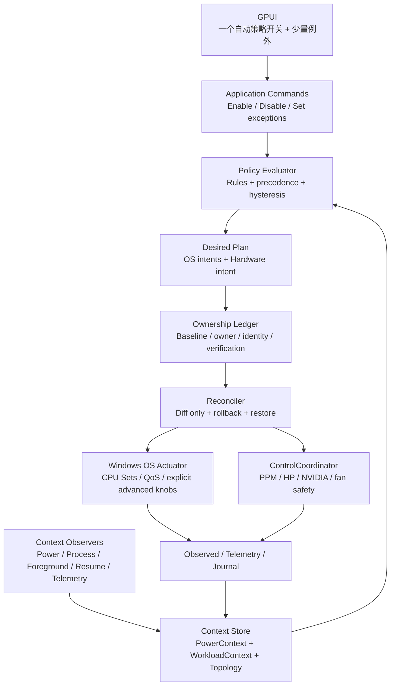

# phelper 自动调度架构设计

> 状态：Phase 1 已实现；后续自动模式仍按本文分阶段推进
> 日期：2026-08-28
> 适用平台：Windows 11；首个验证平台为 OMEN 16-wf0032TX / board 8BAB
> 关联基线：[`architecture.md`](../architecture.md)

本文档定义 phelper 的电源感知自动调度层。它同时记录已实现的第一阶段边界，以及
后续模式的状态、优先级、生命周期、验证方式和落地顺序；未标记为已实现的部分不代表
当前版本已经具备对应行为。

本设计的核心问题不是“还能增加多少个按钮”，而是：

> 在用户没有手动干预时，phelper 能否根据供电状态和工作负载，尽量降低整机功耗，
> 同时不破坏 Windows、应用和固件已有的安全调度能力。

当前实现范围（2026-08-28）：

- 已实现 `PowerContext`：`GetSystemPowerStatus`、活动电源方案和电源事件通知；
  通知不可用时退回低频轮询。
- 已实现 `Off` / `BatteryEfficiency` 两个模式。后者只在确认电池供电时，对当前
  用户会话中通过安全过滤的进程使用 E-core CPU Sets + EcoQoS。
- 已实现手动/自动共享 owner 和基线账本、创建时间 + 路径身份检查、PID 复用防护、
  进程退出后的账本丢弃，以及正常退出时的恢复。
- 已接入应用页和 CLI：`phelper os auto status` 只读；`phelper os auto battery
  --hold N` 用于有边界的实机验证。自动模式默认关闭，当前不持久化。
- 尚未实现 ETW 进程事件、低电量阈值滞回、前台/后台策略、硬 Affinity、硬件 profile
  联动和被强制终止后的外部恢复服务。

这里的“已实现”只表示代码闭环已经存在，不表示 BatteryEfficiency 已经在目标机器
上证明省电；功耗收益仍需按第 20 节和第 22 节做 A/B/HIL 验证。

---

## 目录

1. [决策摘要](#1-决策摘要)
2. [问题定义与边界](#2-问题定义与边界)
3. [术语](#3-术语)
4. [目标与非目标](#4-目标与非目标)
5. [总体架构](#5-总体架构)
6. [输入上下文](#6-输入上下文)
7. [策略分层](#7-策略分层)
8. [状态模型](#8-状态模型)
9. [优先级与所有权](#9-优先级与所有权)
10. [进程资格与排除规则](#10-进程资格与排除规则)
11. [自动模式](#11-自动模式)
12. [Windows API 映射](#12-windows-api-映射)
13. [事件与调度循环](#13-事件与调度循环)
14. [应用与恢复语义](#14-应用与恢复语义)
15. [硬件联动](#15-硬件联动)
16. [持久化与配置](#16-持久化与配置)
17. [UI 设计边界](#17-ui-设计边界)
18. [权限与安全](#18-权限与安全)
19. [失败处理](#19-失败处理)
20. [观测与效果评估](#20-观测与效果评估)
21. [分阶段落地](#21-分阶段落地)
22. [测试计划](#22-测试计划)
23. [暂不解决的问题](#23-暂不解决的问题)
24. [参考项目与官方资料](#24-参考项目与官方资料)
25. [架构不变量](#25-架构不变量)

---

## 1. 决策摘要

### 1.1 自动调度不是一个新的“万能性能模式”

phelper 不新增一个把下列内容混成单个开关的黑盒模式：

```text
Windows 电源计划
CPU PPM
CPU Sets / Affinity
进程 QoS
HP Thermal / 风扇
GPU 平台策略
```

这些控制属于不同的所有者和生命周期。自动调度只产生经过解释的策略意图，
再分别交给 OS 调度执行器和既有硬件 `ControlCoordinator`。

### 1.2 第一优先级是电池节能，不是前台性能增强

第一阶段只需要回答一个可测量的问题：

> 电池供电时，对可接管的用户进程使用 E 核 CPU Sets + EcoQoS，是否能在不破坏
> 基本交互的前提下降低实际放电功率和温度？

在这个问题没有通过 reference machine 的 A/B 测试前，不实现全局前台 P 核、
后台 E 核和硬件 profile 的复杂联动。

### 1.3 默认使用软调度，硬锁 E 核必须独立成实验模式

自动策略默认使用：

```text
E-core CPU Sets preference
+ EcoQoS
```

而不是：

```text
SetProcessAffinityMask(E-core mask)
```

CPU Sets 与 Windows 电源管理更兼容，可以保留系统在必要情况下的调度余地。
硬 Affinity 只允许作为明确命名的实验模式，不能作为普通“节能”模式的实现细节。

### 1.4 电源事件只触发重新评估，不直接驱动写入

电源事件可能只表示一个瞬时变化，也可能和电池、Windows 电源方案、厂商策略
同时变化。因此事件处理流程固定为：

```text
收到事件
    ↓
重新读取完整 PowerContext
    ↓
去抖和状态确认
    ↓
重新计算策略
    ↓
只应用实际发生变化的字段
```

不能收到 `AC/DC` 通知后直接套一组预先写死的命令。

### 1.5 任何自动写入都必须有所有权和恢复账本

自动调度和用户手动控制不能互相覆盖。每一个被自动策略写入的目标字段都必须
记录：

```text
目标身份：PID/TID + creation identity + executable path
原始值
当前自动值
写入来源：Automatic / Manual / Safety
当前 owner
最后验证结果
```

自动策略关闭、切回交流电或 phelper 退出时，只恢复仍由自动策略拥有的字段。

---

## 2. 问题定义与边界

### 2.1 要解决的问题

Windows 在混合架构 CPU 上已经具备自动调度能力，但应用和厂商策略可能给出
相互冲突的信号。phelper 的自动调度层解决的是：

1. 识别当前是交流电还是电池供电；
2. 识别当前 Windows 电源策略和电池节能状态；
3. 为适合接管的用户进程表达效率或性能意图；
4. 让电池策略和 phelper 现有的硬件性能/散热策略协调；
5. 在状态变化、进程退出、程序退出和应用失败时恢复原状态；
6. 用实际放电功率、温度和交互延迟判断策略是否有收益。

### 2.2 “全部程序”在本设计中的准确含义

“全部”不能理解为 phelper 可以控制 Windows 的所有执行单元。用户态工具无法
可靠接管：

- 内核线程；
- 中断和 DPC；
- 受保护进程；
- 部分 SYSTEM 服务；
- 不允许当前令牌修改的其他用户进程；
- 已退出或 PID 已复用的目标。

因此文档中的“全部可接管进程”统一表示：

```text
当前交互用户会话
+ 用户态可执行文件
+ 权限允许打开和修改
+ 不在系统/安全/媒体等排除集合
+ 没有更高优先级的手动 owner
```

### 2.3 前台/后台不是游戏识别

未来可以使用 Windows 的窗口焦点和可见性信息判断通用的前台/后台关系，
但这不等于识别游戏，也不恢复 PresentMon、帧率或帧时间功能。

当前产品边界仍然是：

```text
不识别游戏进程
不启动 PresentMon
不根据游戏数据库切换 profile
不采集帧率/帧时间
```

---

## 3. 术语

### 3.1 PowerContext

某一时刻从 Windows 读取到的完整供电上下文，而不是单个 AC/DC 布尔值。

### 3.2 WorkloadContext

当前进程、窗口、线程和硬件负载的可用事实。它描述观察结果，不直接表示策略。

### 3.3 Automatic Intent

自动策略产生的目标意图，例如：

```text
目标进程 PID 1234
CPU placement = Efficiency
QoS = Eco
```

它不是已验证的实际状态。

### 3.4 OS Scheduler Policy

通过 Windows API 影响进程/线程调度的策略，包含 CPU Sets、QoS、优先级、内存
优先级和理想处理器等字段。

### 3.5 Hardware Policy

通过现有 phelper 控制链影响整机的策略，包含 Windows PPM、HP Thermal、风扇、
GPU 平台策略和实验性功耗限制。

### 3.6 Reconcile

把当前已知的 `DesiredPlan` 与 `ObservedState` 比较，只对差异执行写入，再进行
验证的过程。

### 3.7 Candidate

自动策略允许评估和接管的进程。Candidate 不是“发现到的全部进程”。

---

## 4. 目标与非目标

### 4.1 Goals

#### G-01 — 电源感知

AC/DC、短时直流供电、电量、电池节能状态和活动 Windows 电源方案变化能够被
core 及时观察并进入统一状态模型。

#### G-02 — 低开销

稳定状态下不反复调用写 API；没有变化时的 reconcile pass 不产生写系统调用。

#### G-03 — 软调度优先

自动模式优先使用 CPU Sets 和 QoS，让 Windows 继续参与最终调度。

#### G-04 — 可恢复

自动策略的每个写入字段都可以按目标身份恢复；不因为 PID 复用而污染新进程。

#### G-05 — 可解释

出现问题时能回答：

```text
为什么进入该模式？
命中了哪些规则？
写入了哪些字段？
哪些字段因为权限/能力/排除规则没有写？
退出时是否恢复？
```

#### G-06 — 可验证

能使用实际 CPU package power、放电功率、温度、风扇 RPM 和交互性指标进行 A/B
比较，而不是只凭“感觉更省电”。

### 4.2 Non-Goals

- 不替换 Windows kernel scheduler；
- 不承诺把所有线程永久固定在某类核心；
- 不默认修改 Windows 活动电源计划；
- 不默认修改全局进程优先级；
- 不把所有后台服务强行移动到 E 核；
- 不在前台窗口变化时频繁写 HP 风扇或功耗墙；
- 不把电池充电上限伪装成 CPU 调度功能；
- 不恢复游戏识别、PresentMon、帧率和帧时间采集；
- 不直接写 EC；
- 不在第一阶段实现硬锁 E 核。

---

## 5. 总体架构



### 5.1 模块职责

| 模块 | 职责 | 不负责 |
| --- | --- | --- |
| `PowerContextProvider` | 读取和发布供电上下文 | 直接套用 profile 或写硬件 |
| `WorkloadObserver` | 观察进程、窗口、线程和负载事实 | 判断某程序是不是游戏 |
| `TopologyProvider` | 读取 CPU Sets、P/E 分类和组信息 | 猜逻辑处理器编号 |
| `AutomaticPolicyEvaluator` | 将上下文转换为策略意图 | 打开 Win32 handle 或写 API |
| `OwnershipLedger` | 保存 baseline、owner、目标身份和结果 | 决定 P/E 策略 |
| `OsPolicyReconciler` | 执行 Windows OS 策略差异 | 写 HP EC/WMI |
| `HardwarePolicyPlanner` | 将电源和负载上下文转换为硬件意图 | 直接调用 WMI/PawnIO/NVAPI |
| `ControlCoordinator` | 既有硬件单写者、验证、心跳和恢复 | 观察前后台进程 |
| `PolicyJournal` | 记录自动策略决定和写入证据 | 作为 UI 的状态数据库 |

### 5.2 依赖方向

自动调度必须遵守现有模块边界：

```text
phelper-domain
    └── 纯状态、意图、规则、错误和 ports

phelper-core
    ├── platform/windows_power_context
    ├── platform/windows_process_observer
    ├── platform/windows_os_policy
    ├── automatic_scheduler
    ├── control/ControlCoordinator
    └── telemetry

apps/desktop
    └── 只发送命令、读取 AppState、展示最小结果
```

`automatic_scheduler` 不能绕过既有的 OS policy handle 或硬件
`ControlCoordinator` 建立第三套写路径。

---

## 6. 输入上下文

自动策略只能使用已经声明 owner、来源和新鲜度的输入。任何输入为 unknown 时，
不能猜测成“节能”或“高性能”。

### 6.1 PowerContext

建议领域模型：

```rust
pub struct PowerContext {
    pub source: PowerSource,
    pub battery_percent: Option<u8>,
    pub charging: Option<bool>,
    pub battery_saver: Option<bool>,
    pub active_scheme: Option<Guid>,
    pub configured_mode: Option<WindowsPowerMode>,
    pub effective_mode: Option<WindowsPowerMode>,
    pub observed_at: Instant,
    pub quality: ContextQuality,
}

pub enum PowerSource {
    Ac,
    Dc,
    ShortTermDc,
    Unknown,
}
```

`PowerContext` 必须支持完整快照和来源变化事件。快照用于启动、恢复、事件丢失
后的重建；事件只用于唤醒策略评估。

### 6.2 Windows 电源策略上下文

以下内容只读观察，不默认作为自动写入目标：

```text
活动电源方案 GUID
AC/DC 用户配置的高层模式
实际生效模式
电池节能状态
```

这样 phelper 可以知道 Windows 正在做什么，但不会为了让 UI 标签一致而和 Windows
抢写同一层策略。当前设计仍沿用 [`windows-power-policy.md`](windows-power-policy.md)
的边界。

### 6.3 CPU Topology

拓扑快照至少包含：

```text
CPU Set ID
processor group
logical processor number
core index
efficiency class
parked / allocated / reserved flags
```

P/E 集合必须从 `GetSystemCpuSetInformation` 动态推导。不能写死“前几个逻辑处理器
是 P 核”，也不能把 parked CPU Set 当成可用 E 核。

如果机器是同构 CPU，或者 P/E 分类不可靠，则自动 P/E placement 标记为
`Unsupported`，只保留 QoS 或关闭自动调度；不能猜测。

### 6.4 ProcessContext

自动调度需要比当前手动 PID 列表更完整的身份信息：

```text
pid
creation identity / start time
tid（如果观察线程）
session id
user identity
executable canonical path
file publisher / signature status（可选）
protected / service / system flags
parent pid（可选）
```

PID 只是索引，不是身份。任何延迟执行的写入和恢复都必须重新确认 creation identity
和路径。

### 6.5 ForegroundContext

如果未来启用前台/后台策略，观察事实应为：

```text
foreground window handle
foreground pid/tid
window visible / minimized / occluded
last input age（如可安全获得）
audio or media hint（仅作为观察）
```

它只能说明窗口关系，不能推断：

```text
这个程序是游戏
这个程序一定需要 P 核
这个程序一定可以放到 E 核
```

### 6.6 TelemetryContext

自动硬件策略可使用已有规范指标：

```text
CPU package power / temperature / utilization
GPU power / temperature / utilization
fan RPM
thermal state
```

Telemetry 是事实输入，不应因为一次采样波动直接触发硬件写入。每个输入必须有
新鲜度、质量和采样时间。

---

## 7. 策略分层

自动调度分为三个相互独立的策略层。

### 7.1 Layer A — 电源预算层

根据 `PowerContext` 确定当前整机倾向：

```text
Ac             → 性能预算较宽，不强制省电
Dc             → 效率预算
Dc + saver     → 严格效率预算
Dc + low level → 更严格的效率预算
Unknown        → 暂停新的自动写入
```

这一层不直接决定某个进程使用哪个 CPU，而是给后续层提供预算。

### 7.2 Layer B — OS 工作负载层

把预算转换为进程/线程级 Windows 意图：

```text
BatteryEfficiency:
    eligible process → E-core CPU Sets + EcoQoS

BackgroundEfficiency:
    background eligible process → E-core CPU Sets + EcoQoS
    foreground process           → 不强制覆盖 Windows

ForegroundPerformance（后续）:
    selected foreground process → P-core CPU Sets + HighQoS hint
```

`ProcessPriority`、`ThreadPriority`、`MemoryPriority` 默认不作为自动模式的必选
字段。它们影响面更大，应该只在用户明确选择或后续实验策略中启用。

### 7.3 Layer C — 硬件运行层

根据整机的持续负载、温度和电源预算选择 hardware intent：

```text
DC idle / light  → 低功耗 PPM 偏好，保持安全风扇策略
DC sustained     → 节能硬件 profile
AC sustained     → 允许性能 profile
thermal guard    → 安全散热策略优先
```

硬件运行层是全局的，不能跟着每一次窗口焦点变化写风扇、功耗墙或 HP Thermal。

---

## 8. 状态模型

### 8.1 自动调度状态

```rust
pub enum AutomaticSchedulerState {
    Disabled,
    Observing,
    Applying,
    Active,
    Suspended(SuspendReason),
    Restoring,
    Failed(AutomaticError),
}
```

状态含义：

| 状态 | 含义 |
| --- | --- |
| `Disabled` | 用户未启用自动策略，不拥有任何字段 |
| `Observing` | 已读取上下文，但尚未允许写入 |
| `Applying` | 正在执行一次差异计划 |
| `Active` | 自动字段已验证，进入稳定运行 |
| `Suspended` | 输入不可靠或能力不足，暂不产生新写入 |
| `Restoring` | 释放自动 owner 并恢复 baseline |
| `Failed` | 发生需要用户处理的持久错误 |

### 8.2 策略状态

```rust
pub enum AutomaticMode {
    Off,
    BatteryEfficiency,
    BackgroundEfficiency,
    Adaptive,
    LockedEfficiencyExperimental,
}
```

第一版只实现 `Off` 和 `BatteryEfficiency` 的设计闭环；其他模式先作为架构
预留，不进入 UI 和配置稳定格式。

### 8.3 PowerState

电源状态需要区分来源、稳定性和电量阈值：

```text
AcStable
DcStable
DcSaver
DcLowBattery
ShortTermDc
Unknown / Debouncing
```

USB-C 拔插、充电器功率不足或固件暂时报告未知时，可能短时间出现抖动。
`Debouncing` 期间不重复进出 profile。

### 8.4 WorkloadClass

```text
SystemCritical
Protected
InteractiveForeground
InteractiveBackground
UserBackground
Unknown
```

`Unknown` 不等于 `UserBackground`。无法确认的进程默认不自动接管。

### 8.5 Desired / Observed / Telemetry

继续遵守主架构的三状态原则：

```text
AutomaticDecision / DesiredPlan
    = 自动策略希望发生什么

OsObservedState / HardwareObservedState
    = API/readback 确认了什么

TelemetryState
    = 机器实际运行数据
```

一次 `SetProcessDefaultCpuSets` 返回成功，只能证明调用成功；不能在没有查询或
可验证证据的情况下把它直接显示成“已锁定”。

---

## 9. 优先级与所有权

### 9.1 全局优先级

自动调度的策略冲突按以下顺序解决：

```text
Safety / Thermal Guard
    > User Explicit Override
    > Automatic Scheduler
    > Windows Default Heuristics
```

说明：

- 热安全策略可以覆盖普通自动策略；
- 用户对某个字段明确设置后，自动策略不得覆盖该字段；
- 自动策略只在 Windows 默认行为没有被更高层明确接管时介入；
- Windows 的默认调度始终保留为最终执行者，除非用户显式启用硬锁实验模式。

### 9.2 字段级 owner

进程的 CPU Sets、QoS、优先级和 GPU 首选项不能只用“这个 PID 是否被接管”表示，
必须按字段记录 owner：

```text
(target identity, field) → owner
```

例如：

```text
(PID 1234, CpuPlacement) → Automatic
(PID 1234, ProcessPriority) → Manual
(PID 1234, GpuPreference) → Manual
```

这时自动策略只允许写 `CpuPlacement`，不能顺手把优先级和 GPU 设置清掉。

### 9.3 手动设置与自动设置的合并

用户没有明确设置的字段不是“默认值”，而是 `None / Preserve`：

```text
用户没有选择 QoS → 自动策略可以决定或保持 Windows 当前值
用户明确选择 QoS → 自动策略不能覆盖
用户清除手动值 → 自动策略重新获得该字段的资格
```

不能用 UI 中的默认枚举值代表用户已经选择了该值。

### 9.4 硬件所有权

自动硬件策略只能通过现有 `ControlCoordinator` 申请写入。它不能：

- 自己调用 HP WMI；
- 自己写风扇；
- 自己启动第二个 keepalive；
- 自己恢复 `0x2E {0,0}`；
- 绕过 SafetySupervisor。

---

## 10. 进程资格与排除规则

### 10.1 默认 candidate 范围

第一版候选范围建议为：

```text
当前交互用户
当前 session
有可解析 executable path
不是 phelper 自身
不是受保护进程
不是关键系统服务
```

不以进程名作为唯一身份。`chrome.exe`、`svchost.exe` 或多个同名实例必须按
PID + creation identity + path 区分。

### 10.2 默认排除集合

以下类别默认排除，除非用户明确把单个路径加入例外策略：

- phelper 自身及其子进程；
- `System`、`Registry`、`Idle` 等系统保留目标；
- `csrss.exe`、`smss.exe` 等受保护或关键进程；
- 当前音频、实时媒体和通信关键线程；
- 安全软件、输入法、桌面合成和设备辅助进程；
- 无法确认路径或身份的进程；
- 打开目标失败、读回失败或发生 PID 复用的目标。

排除不是静态字符串黑名单就结束。每次写入前仍要做能力和身份校验。

### 10.3 用户例外

用户可以配置：

```text
always_efficiency: 明确希望节能的程序
always_performance: 明确不能被放到 E 核的程序
never_touch: 永不由自动策略接管的程序
```

例外按规范化路径优先，进程名只作为临时诊断匹配，不能成为稳定配置的唯一键。

### 10.4 进程树

父进程的自动策略不会自动等同于子进程策略。新子进程必须重新经过 candidate
过滤和 identity 建立。

如果未来支持“应用组”概念，应用组必须是显式规则，例如：

```text
root executable + verified child path set
```

不能因为两个程序由同一个 launcher 启动就把它们全部接管。

### 10.5 前台进程的特殊处理

前台只是一个工作负载提示，不是强制性能等级。默认原则：

```text
BatteryEfficiency 模式：前台进程也可以保持 E 优先，但不默认硬锁
BackgroundEfficiency 模式：后台才自动 E，前台不覆盖 Windows
Adaptive 模式：未来才评估前台 P / 后台 E
```

这样可以把“电池节能”和“前台性能优先”两个目标分开，不让一个开关同时承担
互相冲突的承诺。

---

## 11. 自动模式

### 11.1 `Off`

```text
不观察以外的自动动作
不取得任何 owner
不写 OS policy
不写硬件 profile
```

电源上下文仍可作为只读状态供 UI/日志使用。

### 11.2 `BatteryEfficiency`（第一阶段目标）

触发条件：

```text
PowerSource == Dc
且电源状态已稳定
且 topology 有可靠 E-core 集合
且用户启用了该模式
```

默认意图：

```text
eligible user process → CpuPlacement::Efficiency
eligible user process → QosLevel::Eco
```

默认不自动修改：

```text
process priority
thread priority
memory priority
thread ideal processor
hard affinity
Windows active power plan
```

硬件联动在第一阶段只允许使用经过单独验证的节能 profile，并且必须通过既有
硬件写入链；如果硬件 profile 不可用，OS 节能策略仍可以独立运行。

### 11.3 `BackgroundEfficiency`（后续）

只接管被判断为 `UserBackground` 的候选进程：

```text
background → E-core CPU Sets + EcoQoS
foreground → 保持 Windows 默认或用户手动策略
```

这是更保守、交互风险更低的自动模式，但它对“整机电池功耗”的收益可能低于
`BatteryEfficiency`。

### 11.4 `Adaptive`（后续）

它可以根据：

```text
PowerContext
ForegroundContext
CPU/GPU load
temperature
audio/media hints
```

在前台性能和后台效率之间切换。但必须先有：

- 可靠的 candidate 过滤；
- 事件去抖和最短保持时间；
- 字段级 owner；
- 足够的 A/B 数据；
- 失败后可恢复的 HIL 测试。

没有这些基础，`Adaptive` 只是频繁写策略的名称，不进入稳定功能。

### 11.5 `LockedEfficiencyExperimental`

这是用户明确要求“锁 E 核”时使用的实验模式：

```text
eligible user process → E-core hard affinity
```

必须显式显示以下风险：

- 不能覆盖所有进程和内核工作；
- 多 processor group 需要额外处理；
- 可能增加延迟和任务执行时间；
- 可能影响音频、输入、视频和应用自身线程池；
- 不能承诺总电量一定下降。

这个模式不能伪装成普通的“电池保护”。

---

## 12. Windows API 映射

### 12.1 电源状态快照

启动和每次事件唤醒时读取：

```text
GetSystemPowerStatus
    → AC/DC、充电状态、电池百分比、电池节能状态

PowerGetActiveScheme
    → 当前活动电源方案 GUID
```

官方资料：

- [`GetSystemPowerStatus`](https://learn.microsoft.com/en-us/windows/win32/api/winbase/nf-winbase-getsystempowerstatus)
- [`PowerGetActiveScheme`](https://learn.microsoft.com/en-us/windows/win32/api/powersetting/nf-powersetting-powergetactivescheme)

### 12.2 电源事件

观察至少包括：

```text
GUID_ACDC_POWER_SOURCE
GUID_BATTERY_PERCENTAGE_REMAINING
GUID_POWER_SAVING_STATUS
active/effective power mode notifications
```

事件注册由 core 的 Windows observer 负责，不能放在 GPUI 页面生命周期中。事件
回调只投递 `RefreshPowerContext`，不在回调线程中执行写入。

官方资料：

- [`Power Setting GUIDs`](https://learn.microsoft.com/en-us/windows/win32/power/power-setting-guids)
- [`RegisterPowerSettingNotification`](https://learn.microsoft.com/en-us/windows/win32/api/winuser/nf-winuser-registerpowersettingnotification)
- [`PowerRegisterForEffectivePowerModeNotifications`](https://learn.microsoft.com/en-us/windows/win32/api/powersetting/nf-powersetting-powerregisterforeffectivepowermodenotifications)

### 12.3 CPU topology和 CPU Sets

```text
GetSystemCpuSetInformation
    → CPU Set topology / efficiency class / parked / allocated

SetProcessDefaultCpuSets
    → 自动模式的进程级 CPU Set preference

SetThreadSelectedCpuSets
    → 仅手动线程策略或未来明确的线程级例外
```

自动模式不使用逻辑处理器编号推断 P/E。CPU Sets 是软偏好；硬 affinity 仍然是
单独的高级能力。

官方资料：

- [`CPU Sets`](https://learn.microsoft.com/en-us/windows/win32/procthread/cpu-sets)
- [`SetProcessDefaultCpuSets`](https://learn.microsoft.com/en-us/windows/win32/api/processthreadsapi/nf-processthreadsapi-setprocessdefaultcpusets)
- [`SYSTEM_CPU_SET_INFORMATION`](https://learn.microsoft.com/en-us/windows/win32/api/winnt/ns-winnt-system_cpu_set_information)

### 12.4 QoS

进程级自动节能使用 `SetProcessInformation` 的 process power throttling execution
speed 语义，表达 EcoQoS。高性能提示只在未来经过验证的前台策略中考虑，不能用
“清除一个 bit”就宣称前台一定运行在 P 核。

线程级 EcoQoS 只适合已经知道职责的线程。自动策略默认不扫描并修改每一个线程，
避免线程短生命周期带来的大量 handle 和写入。

官方资料：

- [`Quality of Service`](https://learn.microsoft.com/en-us/windows/win32/procthread/quality-of-service)
- [`SetProcessInformation`](https://learn.microsoft.com/en-us/windows/win32/api/processthreadsapi/nf-processthreadsapi-setprocessinformation)

### 12.5 优先级与理想处理器

以下 API 保留给手动高级控制或独立实验：

```text
SetPriorityClass
SetThreadPriority
SetProcessInformation(ProcessMemoryPriority)
SetThreadIdealProcessorEx
```

它们不是 CPU 类型选择的替代品。尤其不能因为进入节能模式就默认把所有进程
设为 Idle priority；这样可能导致系统关键工作得不到及时运行。

### 12.6 硬 Affinity

`SetProcessAffinityMask` / `SetThreadGroupAffinity` 只允许在：

```text
用户明确选择
目标能力已确认
组拓扑已处理
风险被 UI 明确说明
```

时使用。自动节能模式不得暗中降级到硬 affinity。

### 12.7 电源方案写入边界

第一阶段不调用：

```text
PowerSetActiveScheme
PowerWriteACValueIndex
PowerWriteDCValueIndex
```

作为电源事件的自动反应。原因是这些是全局 Windows 策略，改变后会影响所有
进程，且和用户、Windows、厂商工具形成新的写入竞争。

如果未来确实需要自动修改 PPM，必须新增独立的全局策略 owner、baseline、恢复和
HIL 方案，不能从进程级自动调度顺手调用。

---

## 13. 事件与调度循环

### 13.1 事件来源

按优先级分为三类：

#### 必须事件

```text
应用启动
AC/DC 电源来源变化
电池节能状态变化
活动/实际电源模式变化
系统 resume
用户启用/禁用自动策略
```

#### 第一版可选事件

```text
电量百分比变化
拓扑变化或设备重新枚举
目标进程退出
```

#### 后续事件

```text
进程创建
进程退出
前台窗口变化
显示器状态变化
音频/媒体活动变化
```

没有可靠事件时，可以用低频 snapshot reconcile 兜底，但不能用高频全量写入代替
事件架构。

### 13.2 统一处理管线

```text
Native event
    ↓
Context refresh request
    ↓
Power/Workload/Topology snapshot
    ↓
Debounce + freshness check
    ↓
Policy evaluation
    ↓
DesiredPlan
    ↓
Ownership merge
    ↓
Diff / safety validation
    ↓
OS reconciler + hardware coordinator
    ↓
Readback / outcome / journal
```

Native event callback 不能直接调用任何硬件写入 API，也不能持有 GPUI 的 Entity。

### 13.3 时间参数

初始设计目标，不是稳定 API 承诺：

```text
电源事件去抖：500–2000 ms
前台切换去抖：至少 300 ms
策略最短保持：至少 2–5 s
普通 reconcile：2–5 s
硬件 profile reevaluate：5–15 s
```

OS 进程策略和硬件全局策略使用不同 cadence。前者可以快，后者必须慢且有滞回。

### 13.4 事件丢失和自愈

事件通知不是可靠消息队列。以下情况都必须触发完整快照重建：

- watcher 线程重启；
- 事件 payload 无法解析；
- resume；
- 目标进程列表和 ledger 不一致；
- 电源状态长期 unknown；
- Windows 版本/驱动返回不支持。

稳定状态中的 reconcile pass 只修复已知且仍归自动 owner 的差异，不会把用户手动
修改过的值强行改回自动值。

---

## 14. 应用与恢复语义

### 14.1 建立 baseline

第一次自动写入目标字段前捕获：

```text
CPU Sets assignment
QoS / power throttling state
process/thread priority（如果该字段被授权写入）
memory priority（如果该字段被授权写入）
Affinity（仅硬 affinity 模式）
GPU registry preference（仅显式 GPU 规则）
```

未知值与“没有设置”必须区分：

```text
KnownNone
KnownValue
Unavailable
```

`Unavailable` 不能在恢复时伪造为 `KnownNone`。

### 14.2 应用顺序

一次 OS 自动计划按字段独立应用：

```text
1. 确认 target identity
2. 重新读取当前 observed state
3. 过滤被 Manual/Safety owner 占用的字段
4. 生成差异操作
5. 对每一个操作做 capability/permission validation
6. 按安全顺序执行
7. 读取或验证结果
8. 更新 ledger 和 journal
```

未指定字段永远是 preserve，不生成清除操作。

### 14.3 部分失败

自动计划跨越 OS 和硬件两个域时，不假装整个计划是一个原子事务：

```text
OS domain 失败 → 回滚本次 OS domain 的已写字段
Hardware domain 失败 → 交给 ControlCoordinator 的既有回滚/安全语义
另一域已经成功 → 记录 Partial，不虚报全成功
```

安全散热动作不应因为应用级 OS 策略失败而被阻止。

### 14.4 进程退出

进程退出后其进程级 OS 状态自然消失；ledger 需要标记目标已结束并释放条目。
不对同 PID 的新进程执行恢复。

### 14.5 PID 复用

恢复前必须确认：

```text
PID 相同
creation identity 相同
canonical executable path 相同或可证明一致
目标类型相同（process/thread）
```

任一项不能确认，就放弃恢复并报告 `RestoreSkippedIdentityMismatch`。

### 14.6 自动模式退出

以下任一事件发生时释放 Automatic owner：

```text
用户关闭自动调度
从 DC 稳定切换到 AC
拓扑不再可靠
权限/验证错误超过容忍次数
phelper 正常退出
```

恢复顺序必须先释放自动 OS 策略，再让既有硬件 shutdown path 处理其 own owner。

### 14.7 非正常退出

OS 进程策略没有硬件风扇那样的 firmware clawback 保障，因此必须尽量缩短自动
策略的持有范围，并使用：

```text
短周期 reconcile
目标退出自动清理
可选的 helper/service 仅在明确需要后评估
```

第一阶段不新增常驻 Windows service。phelper 被强制终止时，Windows 进程仍会
存活并保留 CPU Sets/QoS，因此后续必须定义“无 watchdog 如何释放”的产品语义，
不能假设进程退出会自动恢复。

---

## 15. 硬件联动

### 15.1 两条控制链保持分离

```text
OS process policy
    → Windows API

Hardware policy
    → ControlCoordinator
    → HP WMI / PowrProf / NVIDIA
```

自动调度器可以同时产生两类 intent，但不能把两条链实现成一个直接写入函数。

### 15.2 不因前台切换写全局硬件

前台窗口变化只可能改变进程级 OS 策略。它不应直接触发：

```text
风扇停转/启动
0x2E {0,0}
HP Thermal 切换
PL1/PL2/PL4 写入
GPU 平台策略写入
```

全局硬件改变必须由持续负载、温度、电源状态和滞回共同决定。

### 15.3 电池硬件策略

如果后续验证通过，DC 模式可以生成独立 hardware intent：

```text
EPP DC 偏效率
合理的 CPU/GPU 功耗预算
保持风扇安全下限
```

但任何风扇策略仍然必须经过现有 SafetySupervisor 和 KeepAliveService。自动调度
不能写 `0,0` 作为“退出自动模式”的快捷方式，也不能把 firmware auto 当成普通
软件温控选项。

### 15.4 电池保护不是 CPU 调度

降低 CPU 放电功率和温度可能有助于降低热应力，但不能替代：

```text
充电上限
电池温度保护
电池健康状态判断
```

这些属于独立的 battery care capability。只有在 reference platform 上找到可靠
的硬件/固件接口并完成读写验证后，才能另立 architecture decision；不得把它们
悄悄塞入自动 CPU 策略。

### 15.5 Windows PPM 的未来联动

Windows PPM 的 AC/DC 参数可以作为硬件 profile 的显式组成部分，但自动调度第一
阶段不根据电源事件偷偷写全局 PPM。原因是：

- PPM 影响所有进程；
- 设置属于活动电源方案；
- 用户、Windows 和厂商工具都可能同时改变它；
- 当前项目定义的手动 PPM 仍是持久系统策略，不具备自动会话恢复语义。

自动 PPM 必须另建全局 owner 和 restore policy。

---

## 16. 持久化与配置

### 16.1 配置原则

自动调度配置应该描述用户意图，不保存易失的 PID：

```text
enabled
mode
candidate scope
exclusions
explicit exceptions
battery thresholds
```

不能把当前 PID 写入 profile 作为稳定配置。

### 16.2 建议的未来配置形态

以下只是设计草案，不是当前接受的稳定 TOML schema：

```toml
[automatic_scheduler]
enabled = false
mode = "battery_efficiency"
apply_on_dc = true
apply_on_battery_saver = true
low_battery_percent = 25
exit_low_battery_percent = 35
event_debounce_ms = 1000
minimum_hold_seconds = 5

[automatic_scheduler.scope]
interactive_user_only = true
allow_system_processes = false
hard_affinity = false

[[automatic_scheduler.never_touch]]
path = "C:\\Program Files\\Example\\audio.exe"

[[automatic_scheduler.always_performance]]
path = "C:\\Games\\Example\\game.exe"
```

注意：示例中的 `game.exe` 只是“用户明确指定的路径”示例，不表示 phelper 需要
识别游戏或内置游戏功能。

### 16.3 Profile 与自动策略的关系

`PerformanceProfile` 和 `AutomaticSchedulerPolicy` 必须保持不同概念：

```text
PerformanceProfile
    = 用户主动选择的硬件/软件目标

AutomaticSchedulerPolicy
    = 根据上下文计算目标的规则
```

profile 可以提供自动策略的参数，但不能让普通 `profile apply` 在没有明确启用
自动模式时偷偷启动后台观察器。

### 16.4 Journal

自动策略日志需要能够按一次 transition 聚合，而不是每个 reconcile pass 打一行：

```text
transition_id
trigger
power context summary
workload rule summary
target identity
planned fields
skipped fields + reason
before / command / after
restore result
```

稳定成功的空 reconcile 不进入用户可见日志。

---

## 17. UI 设计边界

自动调度不应新增一个充满调试细节的页面。建议最终 UI 只暴露：

```text
自动调度：关闭 / 电池节能 / 后台节能
例外程序：少量路径列表
当前状态：交流 / 电池 / 电池节能 / 暂停
```

高级信息放在可展开区域或日志中：

```text
最近一次触发原因
已接管进程数量
被排除的原因统计
恢复是否成功
```

不在 UI 中常驻展示：

- 心跳语义；
- observer 线程；
- 每次 API 调用；
- “引擎运行中”；
- 没有决策价值的已应用文本；
- 全量进程表；
- 每个 CPU Set 的原始 ID。

UI 只消费 `AppState`，不打开进程 handle、不读取电源 API、不执行策略判断。

---

## 18. 权限与安全

### 18.1 权限最小化

自动 observer 默认只使用读取权限。需要修改目标时才申请最小的 process/thread
访问权；不默认启用 `SeDebugPrivilege`。

权限不足是单目标的 `Skipped/PermissionDenied`，不是把整个自动调度切换到未知的
更高权限行为。

### 18.2 受保护目标

无法打开、读取身份或验证策略的进程必须 fail closed：

```text
不写
不清空未知字段
不把失败显示成已应用
```

### 18.3 不开放危险优先级

自动调度不开放：

```text
REALTIME_PRIORITY_CLASS
THREAD_PRIORITY_TIME_CRITICAL
```

这与现有手动 OS policy 的安全边界一致。

### 18.4 多 processor group

自动 CPU Sets 必须 group-aware。不能用单个 `u64` Affinity mask 假设机器只有
一个 processor group。硬 affinity 的多组实现未完成前，自动模式不得降级使用它。

### 18.5 安全散热优先

自动 OS 调度策略失败时，现有 HP 风扇、thermal、watchdog 和退出恢复路径必须
保持独立可用。任何自动策略不能成为散热安全的唯一依赖。

---

## 19. 失败处理

### 19.1 输入失败

```text
PowerContext unknown
    → 暂停新自动写入

Topology unknown
    → 禁用 P/E placement，保留只读观察

Process identity unknown
    → 跳过目标

Telemetry stale
    → 不触发硬件 profile transition
```

### 19.2 Windows API 失败

单个目标的失败不应破坏其他目标；但相同错误连续出现时应进入 backoff：

```text
第一次失败 → 记录
短期重复 → 不重复刷日志，等待下一次事件/周期
持续失败 → 暂停该目标或该字段 owner
```

### 19.3 自动策略和 Windows/其他工具竞争

如果 readback 发现值被外部工具改变：

```text
自动 owner 仍有效 → 按策略规则决定是否重申
用户手动改变了同一字段 → 转移为 Manual owner，不覆盖
来源无法判断 → 暂停该字段，保留证据
```

第一版不杀进程、不关闭 OGH、不强行夺回所有外部写者。

### 19.4 恢复失败

恢复失败必须保持：

```text
owner 状态 = RestoreFailed
observed = Unknown 或实际读回值
UI = 简短可行动提示
journal = 完整证据
```

不能显示“已恢复”。

---

## 20. 观测与效果评估

### 20.1 必须测量的收益指标

至少记录以下指标的时间序列：

```text
电池放电功率（如果 Windows/平台能可靠提供）
CPU package power
GPU power
CPU/GPU temperature
fan RPM
battery percentage slope
```

### 20.2 必须测量的代价指标

```text
前台交互延迟
应用启动时间
音频 glitch / underrun
视频掉帧
任务完成时间
进程 API 失败率
策略切换次数
恢复失败率
```

“CPU 占用下降”不等于“电池总耗电下降”。如果 E 核让任务执行时间明显变长，
必须比较相同任务完成后的总能耗，而不仅是瞬时瓦数。

### 20.3 A/B 测试条件

比较必须固定：

```text
相同电源和电池区间
相同屏幕亮度和刷新率
相同网络/外设状态
相同 workload
相同风扇基础策略
相同 Windows 电源方案
```

至少比较：

```text
Windows 默认
phelper BatteryEfficiency（CPU Sets + EcoQoS）
强制硬 Affinity（仅实验对照）
```

---

## 21. 分阶段落地

### Phase A — 只读 PowerContext

目标：不写任何 OS 或硬件策略。

```text
GetSystemPowerStatus snapshot
PowerGetActiveScheme
电源事件 observer
电池节能状态
AppState 只显示一个简短状态
```

验收：拔插电源、充电、低电量、节能模式切换时，状态稳定且不会触发硬件写入。

当前状态：已实现。`PowerSettingRegisterNotification` 只发“重新读取”提示，核心不会
直接相信通知 payload；同时保留 10 秒轮询兜底。

### Phase B — 自动调度 domain model

目标：只添加 domain、规则、状态机、owner 和测试，不连接真实写入。

验收：用固定 fixture 验证：

```text
AC/DC transition
debounce
low battery hysteresis
manual override precedence
unknown fail closed
PID reuse
partial failure
```

当前状态：已实现第一版 mode/phase/owner/read-model；低电量阈值和完整 fixture 测试
仍是后续工作。

### Phase C — 显式候选进程的 OS dry-run

目标：对用户明确选择的进程生成计划，只打印：

```text
candidate
planned CPU Sets
planned QoS
skipped fields
```

不写真实目标。

### Phase D — BatteryEfficiency 实写

目标：仅实现：

```text
DC stable
eligible user process
E-core CPU Sets
EcoQoS
baseline / restore
```

不修改硬 affinity、优先级、Windows active scheme 或硬件 profile。

验收必须包含真实进程启动/退出、程序退出、PID 复用和权限失败。

当前状态：已实现第一版实写。进程扫描使用当前会话、可读路径、系统路径/关键进程
排除和 creation-time 身份；每 2 秒 reconcile 一次。稳定 pass 不重复写 API，手动
owner 优先。真实机器上的功耗、音频和应用兼容性验收尚未宣告完成。

### Phase E — 电池硬件 profile 联动

只有 Phase D 的功耗/稳定性数据满足目标后，才评估联动：

```text
EPP DC
CPU/GPU power budget
fan curve safety
```

所有硬件动作继续走 `ControlCoordinator`，并单独完成 reference-machine HIL。

### Phase F — BackgroundEfficiency

加入后台/前台事实观察和规则，但仍默认使用软 CPU Sets + QoS。前台程序不自动
强制 P 核。

### Phase G — Adaptive

只有在有足够 A/B 证据后，才允许前台 P 核、后台 E 核的综合策略。它仍不是游戏
识别功能。

### Phase H — LockedEfficiency 实验

最后才评估硬 Affinity 锁 E 核。必须独立开关、独立日志、独立恢复和独立风险提示，
不能让普通节能模式暗中使用它。

---

## 22. 测试计划

### 22.1 Domain 单元测试

覆盖：

```text
PowerContext 分类
AC/DC 去抖
电池阈值滞回
mode precedence
manual owner 覆盖 automatic owner
unknown 不产生写计划
同一目标差异合并
稳定 pass 不产生 syscall plan
```

### 22.2 Process identity 测试

覆盖：

```text
相同 PID + 不同 creation identity → 拒绝恢复
相同 PID + 不同 path → 拒绝恢复
进程退出 → ledger 清理
同名多实例 → 分别处理
子进程启动 → 重新过滤
```

### 22.3 OS backend 测试

使用 mock actuator 验证：

```text
CPU Sets apply / clear
EcoQoS apply / restore
partial write rollback
permission denied
readback mismatch
multi-group topology
parked / allocated CPU Set 过滤
```

### 22.4 Windows read-only HIL

在 reference machine 上验证：

```text
启动快照与事件状态一致
AC/DC 拔插不会写硬件
电量和 battery saver 事件可恢复读取
CPU topology 与真实 P/E/parked 状态一致
```

### 22.5 OS write HIL

只对测试进程执行：

```text
启动测试 worker
BatteryEfficiency apply
创建新线程验证 process default 继承
退出/禁用自动策略验证 restore
强制 kill phelper 后记录未恢复边界
```

不对系统进程、真实音频服务或用户正在工作的应用做无授权写入测试。

### 22.6 硬件联动 HIL

单独验证硬件 profile：

```text
电池进入/退出策略
CPU/GPU 负载和温度滞回
风扇不会被自动调度写成 0
控制心跳仍只有一个
硬件写失败不影响 OS restore
```

---

## 23. 暂不解决的问题

以下问题在架构上明确留白，不在第一版中偷偷做掉：

1. “所有后台程序”的完美定义；
2. 音频、视频、输入和桌面合成线程的完整识别；
3. 硬 Affinity 在多 processor group 上的全覆盖；
4. 被强制终止后自动释放其他进程 CPU Sets/QoS 的常驻 helper 方案；
5. Windows 和第三方工具同时写同一字段时的绝对仲裁；
6. 自动修改活动 Windows 电源方案；
7. 电池充电上限和电池健康控制；
8. GPU 已运行进程的迁移；
9. 游戏检测、PresentMon 和帧时间闭环；
10. 跨机型 P/E efficiency class 的统一标定；
11. 用硬件功耗模型预测“锁 E 一定更省电”；
12. 用一个 UI 状态标签表达所有底层 owner 和恢复细节。

这些问题没有被解决前，产品应保持“节能策略可能跳过目标，但不能猜测和强写”的
保守行为。

---

## 24. 参考项目与官方资料

### 24.1 开源项目

这些项目用于了解实际 API 使用和边界，不复制实现代码，也不改变 phelper 的
许可证约束：

- [EcoQos](https://github.com/sense1024/EcoQos)：较小的 EcoQoS + E 核 Affinity
  工具，展示了进程扫描、排除项和权限失败的简单路径。
- [nshcpuset](https://github.com/nashcom/nshcpuset)：围绕混合架构、QoS 和 CPU
  Sets 的 P/E 核问题排查工具，适合参考 CPU Sets 的使用边界。
- [CPU Set Setter](https://github.com/SimonvBez/CPUSetSetter)：面向应用/游戏的
  手动 CPU Sets 工具，清楚区分软 CPU Sets 与硬 Affinity。
- [ProcGovernor](https://github.com/Prohect/ProcGovernor)：包含 CPU Sets、进程
  监控、ETW、优先级、内存/I/O 策略、滞回和差异执行，作为复杂自动管理器的
  架构参考，不作为 phelper 的功能清单。
- [Osmium](https://github.com/NXRKYMANE/Osmium)：展示了按 CPU 阈值自动进入/退出
  EcoQoS 的实现思路，适合参考自动状态机和忙闲滞回。

本次实现还针对实际 issue 做了反向约束：

- [CPUSetSetter #91 — Zombie Processes](https://github.com/SimonvBez/CPUSetSetter/issues/91)：
  说明长期维护进程句柄/状态会造成残留；phelper 的自动 reconcile 不保留进程句柄，
  进程退出后只丢弃已无目标可恢复的 ledger 条目。
- [CPUSetSetter #68 — Wrong CCD parked](https://github.com/SimonvBez/CPUSetSetter/issues/68)：
  说明拓扑/停放副作用可能跨越工具生命周期；phelper 不写全局 core parking，也不把
  自动节能降级成硬 Affinity。
- [CPUSetSetter #71 — Set CPU Set masks for other processors](https://github.com/SimonvBez/CPUSetSetter/issues/71)：
  说明无条件的核心限制可能影响音频等实时工作；第一阶段只使用软 CPU Sets + QoS，
  并排除音频桌面关键进程。
- [ProcGovernor 的 CPU Sets apply 说明](https://github.com/Prohect/ProcGovernor/blob/master/docs/en-US/apply.rs/apply_process_default_cpuset.md)：
  采用“读取现状、比较后再写”的思路；phelper 的 worker 同样把事件当作 refresh
  hint，而不是直接执行一串写入。
- [EcoQos README](https://github.com/sense1024/EcoQos)：其 group-0、名称匹配和权限
  限制是 phelper 不采用“只按进程名 + 单组硬亲和”的原因。
- [Osmium changelog](https://github.com/NXRKYMANE/Osmium/blob/main/CHANGELOG.md)：其
  连续采样、忙闲滞回和子进程状态重置是后续 Adaptive 模式的参考，不被提前复制到
  第一版电池模式。

这些项目共同说明：实际可用的工具通常只解决 CPU placement、EcoQoS 或自动触发
中的一部分；没有一个简单 API 可以替代策略、权限、恢复和效果评估。

### 24.2 Windows 官方资料

- [CPU Sets](https://learn.microsoft.com/en-us/windows/win32/procthread/cpu-sets)
- [SetProcessDefaultCpuSets](https://learn.microsoft.com/en-us/windows/win32/api/processthreadsapi/nf-processthreadsapi-setprocessdefaultcpusets)
- [SetProcessInformation](https://learn.microsoft.com/en-us/windows/win32/api/processthreadsapi-setprocessinformation)
- [Quality of Service](https://learn.microsoft.com/en-us/windows/win32/procthread/quality-of-service)
- [GetSystemPowerStatus](https://learn.microsoft.com/en-us/windows/win32/api/winbase/nf-winbase-getsystempowerstatus)
- [PowerGetActiveScheme](https://learn.microsoft.com/en-us/windows/win32/api/powersetting/nf-powersetting-powergetactivescheme)
- [Power Setting GUIDs](https://learn.microsoft.com/en-us/windows/win32/power/power-setting-guids)
- [RegisterPowerSettingNotification](https://learn.microsoft.com/en-us/windows/win32/api/winuser/nf-winuser-registerpowersettingnotification)
- [Power Management Functions](https://learn.microsoft.com/en-us/windows/win32/power/power-management-functions)

---

## 25. 架构不变量

自动调度实现和后续扩展前，下面规则必须保持成立：

1. **电源事件不直接写入。** 事件只触发 context refresh。
2. **未知不猜测。** Unknown power/topology/process identity 不产生新的自动写入。
3. **CPU Sets 优先于硬 Affinity。** 自动模式不暗中使用硬锁。
4. **电源策略和工作负载策略分层。** AC/DC 预算不等于前台/后台分类。
5. **OS 调度和硬件控制分离。** OS observer 不能直写 HP/NVIDIA。
6. **硬件写入只有一个 ControlCoordinator。** 不新增自动调度专用写线程。
7. **用户明确设置优先。** 自动策略不能清除未参与字段，也不能覆盖 Manual owner。
8. **进程身份不由 PID 单独定义。** 恢复必须检查 creation identity 和路径。
9. **恢复失败如实报告。** 不把 API success 或清理 ledger 当成恢复成功。
10. **风扇安全独立。** 自动 OS 策略不能影响固件接管、fan watchdog 和安全释放。
11. **稳定状态不刷写。** reconcile pass 没有差异时不产生写 syscall。
12. **效果用功耗和代价验证。** 不凭 CPU 占用或 UI 感觉宣布“省电”。
13. **不重新引入游戏功能。** 前台观察不等于游戏识别，自动调度不依赖 PresentMon。
14. **先 core 后 UI。** 策略、所有权、恢复和测试稳定后，UI 只暴露少数用户决策。
15. **先做 BatteryEfficiency，再做 Adaptive。** 没有 A/B 和 HIL 证据，不扩大自动范围。

最终希望得到的不是一个“会不断改设置”的后台脚本，而是一个可暂停、可解释、
可恢复、可测量的策略协调器：

```text
PowerContext
    + WorkloadContext
    + Topology
    + User Intent
        ↓
Automatic Policy Evaluator
        ↓
OS Intent + Hardware Intent
        ↓
Ownership Ledger + Reconciler
        ↓
Verified Observed State
```
