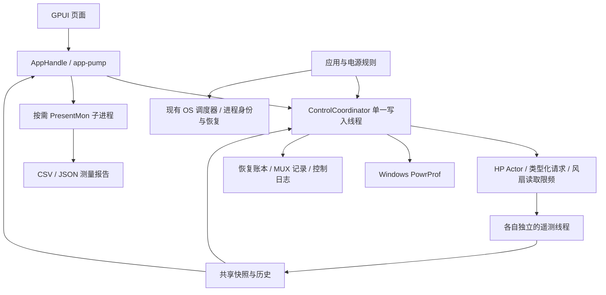

# OGH 复现阶段 1–4：实现与验收状态

用户于 2026-09-05 同意做到第四阶段。这里的阶段编号属于本次工作，与历史文档的 M1–M8 不同。目标机器仍为 OMEN 16-wf0032TX、81L09PA、8BAB。第五阶段的网络、音视频、灯效生态、游戏库与云服务不在本次范围内。

代码与自动化检查已落地；实际功耗对照、睡眠恢复、MUX 双向重启尚未验收。降压完成了依赖与限制调查，写入后端仍未接通。不能将这些状态表述为“已完整替代 OGH”或“第四阶段硬件功能全部可用”。

## 本次实现

| 阶段 | 已实现 | 验收边界 |
|---|---|---|
| 1 控制可靠性 | 绝对心跳期限、分步执行与延迟读回、退出优先、写前基线与恢复账本、GPU/PL 恢复读回、实际配置状态与偏移检测、跨进程写入租约、独立遥测线程、HP 风扇共享 1 Hz 缓存 | 模拟回归通过；未重新进行全部硬件生命周期测试 |
| 2 性能控制 | 自定义 TOML 配置编辑/保存/载入、AC/DC EPP/EPP1/频率/性能上下限/睿频、热模式、双风扇四点曲线、手动/最大/固件自动、cTGP/PPAB、实验 PL1/PL2/PL4、恢复与诊断导出 | 桌面只读检查通过；新版本未进行 OGH 顺序对照 |
| 3 自动化与测量 | AC/DC 与完整 EXE 路径规则、列表优先级、上下文稳定后切换、手动优先、会话恢复；复用电池 E 核 CPU Sets/EcoQoS；按需 PresentMon、单交换链统计、同程序报告对比 | 自动规则/恢复/PID 身份逻辑有测试；ETW 实测受当前令牌权限限制 |
| 4 硬件能力 | MUX 开发写入链路、持久化待重启状态、跨启动核验、BIOS 变化失效、桌面双向验证门槛；XTU/OEM SDK/VBS 只读检查；降压、CPU/内存超频、充电上限分别报告 | MUX 写入与双向重启未实测；降压等高级后端保持不可用 |

## 架构与状态语义

- DesiredState 表示意图；ObservedState.active_profile 只在整套配置完成后标记。部分失败、安全接管或可读字段偏离会清除实际配置标记。热模式、最大风扇与软件曲线仍标为信任写入，不能宣称全部硬件已验证。
- GPU 与功耗基线在首次接管前捕获。HP 写入前先持久化恢复义务；超时或传输异常不能当成“没写入”。失败步骤显示结果未知，未完成恢复的记录继续保留。
- 手动 PPM 设置按 Windows 语义保留到退出以后。自动会话只恢复其接管字段，并核验原电源计划 GUID。无法读取原始热模式时以 Balanced、风扇以固件自动作为安全交还目标，不能声称精确还原一个未知的 OGH 状态。
- 延迟验证不再占用控制线程睡眠。单次 HP Actor 调用仍有约 5 秒的等待上界；正在固件内执行的调用无法由用户态强行取消，因此并非硬实时控制器。
- 写入租约覆盖新版 CLI/桌面；启动时另检查旧桌面实例。OGH 检测仍为警告，实机对照应顺序运行。不会杀掉旧实例或第三方服务。
- 自定义配置的 os_policy 需要显式进程目标。性能编辑页保留该字段，但不会将它应用到任意进程。自动切换页提供独立、默认关闭的电池进程节能选项。
- 不增加 EC、通用 MSR/MCHBAR 写入，不修改 BIOS、安全设置或驱动配置。

## 构建与文件

稳定桌面：`cargo build --release -p phelper-desktop`。
产物：target/release/phelper-desktop.exe；正常启动沿用管理员提权流程。
--read-only 使用单独实例名和日志，关闭窗口即退出，也不修改开机启动任务。

实验功耗桌面：`cargo build --release -p phelper-desktop --features experimental`。
MUX 开发工具：`cargo build --release -p phelper-cli --features experimental-mux`。
桌面即使编入 experimental-mux，也必须有同主板、同 BIOS 的双向重启验证记录。

用户数据位于 %LOCALAPPDATA%/phelper/：

- profiles/*.toml：自定义配置；内置名称不能覆盖。
- automation.toml：电源/应用规则及可选的电池进程节能。
- state/control-journal.jsonl：控制证据；8 MiB 检查点与一代备份。
- state/control-journal.recovery.json：尚未完成的恢复义务。
- state/control-journal.mux.json：待重启选择与双向验证记录。
- measurements/：PresentMon CSV、错误日志、带硬件快照和配置上下文的 JSON。
- reports/：诊断报告，含最多 100 条控制日志尾部、恢复与 MUX 记录。

安装包包含固定版本 PresentMon 2.5.1 的便携控制台和许可证，放在安装目录的 tools/ 与 licenses/ 下。构建脚本核验官方发布资产 SHA-256。开发或便携运行时也可用 scripts/install-presentmon.ps1 安装到用户工具目录，程序优先使用安装目录中的版本。不会安装 PresentMon 服务或驱动。采集仅停止自己创建的唯一 ETW 会话；停止助手有超时边界，退出时等待自己拥有的子进程结束。

测量要求 5–300 秒、至少 100 个有效帧间隔。按 PID 分组后选择帧数最多的交换链，不混入其他进程/叠层交换链。平均 FPS 为呈现间隔平均值的倒数；1% low 为最慢 1% 间隔平均值的倒数；p95/p99 为最近秩分位数。它们不是屏幕实际显示帧率。比较页面只允许相同程序路径，场景、版本、画质与预热条件仍由操作者保持一致。

## 本机只读调查与第四阶段限制

2026-09-05 检查结果：

- BIOS F.30；旧版 phelper-desktop 已在运行。测试使用独立只读预览，没有停止旧版，也没有由新版本操作功耗、MUX 或电压。
- XTU3SERVICE 运行，XtuService.exe 版本 7.14.2.69。
- HP OmenCap 目录包含 IntelOverclockingSDK.dll，版本 7.14.2.67，783368 字节；签名检查有效。静态 PE 检查未发现该 DLL 的原生导出函数。
- 同目录 SdkWrapperForNativeCode.dll 有 46 个 C++ 导出，包含 GetControl/GetValue/Tune/ApplyChanges/SetSuspendRestoreOptions 等符号。只读取文件元数据与导出表，没有加载或调用 OEM SDK。缺少可验证的结构体布局、控制项定义、服务契约及恢复流程，不能直接当成 Rust FFI。可再分发条件也未得到确认。
- Windows DeviceGuard 报告 VBS 状态 2，安全服务运行列表为 [2]。Intel 的 UVP 文档将运行中的 hypervisor/VBS 列为运行时降压的限制条件。没有据此推断本机 UVP 的具体位值，也没有关闭 VBS/HVCI。
- 未发现经过验证的 phelper 电压写入/独立读回后端，因此没有电压滑块。CPU 超频、内存超频和电池上限分别保持“应用后端未接通/硬件未确认”。

参考资料：

- [HP 功能兼容表](https://support.hp.com/us-en/document/ish_9237683-9237735-16)：型号系列能力不能替代当前 BIOS 的运行时探测。
- [Intel UVP 与 VBS 条件](https://www.intel.com/content/www/us/en/support/articles/000094219/processors.html)。
- [Linux hp-wmi](https://github.com/torvalds/linux/blob/master/drivers/platform/x86/hp/hp-wmi.c)：Legacy MUX 协议参考；本实现仅开放 0/1，写组 0x02、命令 0x52、四字节输入/输出。
- [PresentMon 2.5.1](https://github.com/GameTechDev/PresentMon/releases/tag/v2.5.1) 与 [控制台参数](https://github.com/GameTechDev/PresentMon/blob/v2.5.1/README-ConsoleApplication.md)。
- [Intel i9-13900HX](https://www.intel.com/content/www/us/en/products/sku/232171/intel-core-i913900hx-processor-36m-cache-up-to-5-40-ghz/specifications.html)：8P+16E、55 W PBP/157 W MTP，不代表 HP 固定 PL 默认值。
- [HP GPU 功耗资料](https://support.hp.com/cn-zh/document/ish_8109251-8406976-16)：系列 RTX 4060 的 140/135 W 资料不能直接作为本 SKU 的可写上限。
- [参考 SKU](https://support.hp.com/us-en/product/product-specs/omen-by-hp-16.1-inch-gaming-laptop-pc-16-wf0000/model/2101605956?sku=81L09PA)：单区白色背光，不能按 RGB 设备实现。

## 实机验收步骤

1. 正常退出旧版 phelper；记录 OGH、HP/Intel 驱动、BIOS、AC/DC、电源计划、NVIDIA 驱动、游戏版本与画质。保存当前工作。新旧控制器与 OGH 不并行写入。
2. 先跑 OGH：固定场景预热，再采集至少三轮相同时长数据与硬件快照。退出 OGH 后跑 phelper 同场景；记录平均/1% low/p95/p99、功耗、温度、风扇与节流原因。不同运行轮次是独立报告，不能只挑最好的一次。
3. 验证配置切换、手动覆盖自动规则、应用退出、AC/DC 切换、睡眠/唤醒、正常退出。检查 Windows PPM 读回及恢复账本。失败时使用恢复按钮或 `phelper-cli control restore`；不要删除待恢复账本来隐藏问题。
4. 实验功耗按已有 0x29 运行手册验证写入、MSR/MCHBAR 读回及负载表现。PL4 的寄存器读回不能替代瞬态保护效果验收，byte3 始终不写。
5. MUX 在管理员开发工具中执行 `phelper-cli control mux discrete` 或 hybrid。检查待重启记录，再由操作者自行重启。重启后运行 control status 核对，然后反向重复。重启前读到目标不算成功；BIOS 变化后需重新验证。没有自动重启、自动强制回滚或“已验证”标记绕过开关。

以上需要实际硬件会话。当前普通令牌打不开 PawnIO/HP WMI；PresentMon 实际启动返回 ETW Access Denied。下一步是在正常退出旧实例后，在管理员会话按上述顺序验收，不能把模拟测试替代这些结果。

## 验证记录

- 自动化：稳定工作区 189 项、全功能工作区 200 项、无默认功能核心 68 项测试通过；全功能与最小配置 Clippy 使用 -D warnings 通过。后续 MUX 重开状态修正通过对应回归。测试覆盖绝对心跳期限、延迟验证期间心跳、恢复账本、实际配置偏移、自动会话与手动优先、路径/进程身份、共享风扇缓存、MUX 跨启动及帧统计。
- 发布版只读 UI：检查概览、性能编辑/载入/滚动、自动切换、测量/诊断、硬件页；成功从界面导出并解析诊断 JSON（主板 8BAB、BIOS F.30、30 项遥测条目）。
- 诊断导出的后续版本也已检查：控制日志尾部为 100 条。只读关闭复测进程约 55 ms 退出，Engine 清理约 10 ms，未再出现先销毁窗口造成的 GPUI 句柄错误。这次运行没有可用的 HP/PawnIO 控制后端，不能代表真实硬件恢复耗时。
- PresentMon 便携文件 SHA-256 与版本/参数检查通过；实际 ETW 会话被权限拒绝，未生成有效游戏帧时间实测报告。
- 初始已有改动完整保留，开始前补丁另存于工作区之外；未提交或部署。

## 2026-09-22 W-A 会话 A 准备段记录

被测 commit `3850ce0`。管理员会话（UAC 协助模式）；操作手册见
[`v0.3.0-wa-runbook.md`](v0.3.0-wa-runbook.md)。

**能力基线复测**：probe 与 30 s telemetry 自检均通过，与 v0.2.0 提权基线零
回归（HP 域全 SUPPORTED、SDD V1/PL4=200W/MUX Hybrid、6 provider 全 ok、调度
抖动 14–19 ms）。v0.3.0 的 ports.rs（heartbeat 拆分等）改动无实机影响。
证据：`probe-out/wa-session-A-probe.txt`、`wa-session-A-telemetry30.txt`。

**发现 A（严重，修复已实测）**：v0.2.0 的 journal append-time 轮转
（copy + truncate）在 journal 跨过 8 MiB 后每次 `os error 5`，append 全部
失败——`phelper-desktop.log` 累计 50,861 条 `journal append failed`。期间
硬件写入本身全部成功（0x27/0x2E accepted），但 §56 证据丢失，含一次完整
shutdown 恢复序列。失败链中对 append 模式句柄执行 `set_len(0)` 是首要嫌疑
环节，未逐段归因（修复优先于归因）。v0.3.0 的统一路径（fsync→rename→
reopen，`ef7eff9`）实测确认修复：open-time rotation 将 8,388,890 字节旧
journal 完整转存 `.1.jsonl`（rename 保留原 mtime）；随后一次幂等 EPP 写入
（AC/DC 0）落盘 674 字节完整 JSONL 条目，write→readback→Verified 97 ms。
证据：`probe-out/wa-journal-fix-status.txt`、`wa-journal-fix-epp.txt`。
断裂数据无法补录，本记录即为该窗口的替代证据。

**发现 B（V7 素材）**：重负载（CPU avg 86.5 °C / max 100 °C）下安全层在
`ForceMaxFan(≥90 °C)` 与 `ReleaseTo(Curve)(≤85 °C)` 之间以 2–4 s 周期振荡
——曲线 85 °C 点位（55 档 = 5500 RPM）压制力不足以退出迟滞带。行为符合
迟滞设计语义，但每次振荡伴随一对 0x27/0x2E 写；V7 soak 需评估安全释放与
曲线求解之间是否加入最小保持时间。证据：`phelper-desktop.log`
09:00:13Z–09:02:57Z（UTC）段。

**账本与退出语义顺带确认**：托盘正常退出执行 0x27 off → 0x2E auto →
0x22（startup 值）→ 0x1A balanced，四步全部 accepted，总耗时 1070 ms；
recovery 账本义务清零；退出后 0x21 读回 ctgp=false/ppab=false/dstate=1 与
startup 捕获值一致。
